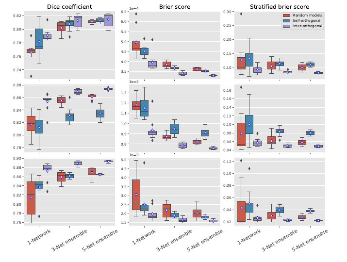
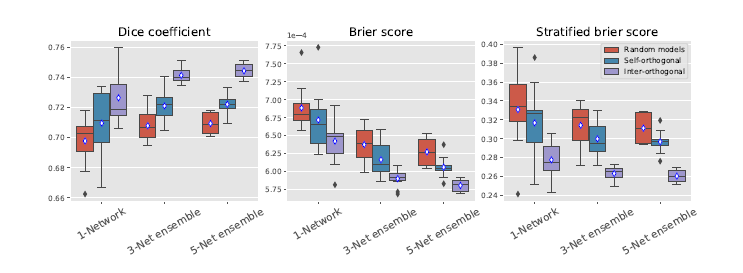

# 
Orthogonal Ensemble Networks for Biomedical Image Segmentation

#### 
By David Wang

## 1. 论文简述
&emsp;&emsp;《用于生物医学图像分割的正交集合网络》，出自MICCAI 2021 pp 594-603。引用格式为(APA)：  
  
Larrazabal, A.J., Mart'inez, C., Dolz, J., & Ferrante, E. (2021). Orthogonal Ensemble Networks for Biomedical Image Segmentation. *Medical Image Computing and Computer Assisted Intervention – MICCAI 2021 pp 594-603.*  
  
&emsp;&emsp;本篇论文首先概述了一个先前的Deep Learning模型的缺点：**校准能力差，导致预测结果过于保守**。随后提出**集合学习**这一学习策略，可以提高模型的鲁棒性和校准性能。本文的贡献为：提出了一个可以提高深度卷积神经网络(DCNN)集合的模型多样性的策略，即假设可以利用集合的模型的**正交化**来提升模型整体的多样性，从而提高预测性能和更好的校准模型输出。
## 2. 知识整理
### (1). Ensemble learning
&emsp;&emsp;集合学习的一种常见的方法是在不同的条件下训练同一个模型，这可以促进模型收敛到不同的函数解。常见的生成集合方式有：  
- dataset shifting
- Monte-Carlo Dropout
- batch-ensemble
- different model hyperparameters
  
通过预测的平均值，个别错误可以被排除，从而减少误判（miscalibration）。在这种情况下，确保模型的多样性是建立一个鲁棒的集合的关键因素。  
### (2). Orthogonal Ensemble Networks for Image Segmentation
&emsp;&emsp;对于一个数据集$\mathcal{D}=\{(x,y)_i\}_{0\le i\le |\mathcal{D}|}$，x为图片，y为相应的分割标志，用$\mathcal{p}(y_j=k|x)$表示一个给定的像素（二维/三维）$j$，从一组可能的类$\mathcal{C}$中分配给类$k\in \mathcal{C}$的概率。使用神经网络$f_\mathbf{w}$来近似该分布，$\mathbf{w}$为权重，则表示形式为$f_\mathbf{w}(x)=\mathcal{p}(y|x;\mathbf{w})$，通过学习得到参数$w$来得到训练集上的最小化损失函数。对于一组给定的分割网络$\{f_{\mathbf{w}^1},f_{\mathbf{w}^2},...f_{\mathbf{w}^N},\}$，建立集合网络$f_\mathbf{E}$的一个简单策略为对预测结果取平均值：  
$$f_\mathbf{E}=\frac{1}{N}\sum_{i=1}^Nf_{\mathbf{w}^i}(x)$$  
根据之前的假设，让模型集$f_{w}^i$多样化可以提升预测的准确率和校准性，因此在训练过程中加入成对的正交性约束可以提升整体的性能。  
&emsp;&emsp;**通过正交约束诱导模型多样性**。对于一个给定的神经网络，诱导卷积*filters*之间的正交性可以有效减少*filter*冗余。利用这一原则，可以避免单一神经模型内的冗余和神经模型集合的各个组成部分之间的冗余。  
&emsp;&emsp;根据**基本数学知识**，正交化应该是做**余弦运算**。对于给定的两个向量$\mathbf{x}$和$\mathbf{y}$，余弦相似度表示正交性，-1为完全相反，1为完全相同，0表示正交。有：  
$$SIM_C(\mathbf{x},\mathbf{y})=\frac{<\mathbf{x},\mathbf{y}>}{||\mathbf{x}||\  ||\mathbf{y}||}$$
将余弦预算结果取平方（这样同时考虑了正相关和负相关），可以得到集合模型内部和之间的多样化带来的损失函数。其中自正交损失为：  
$$\mathcal{L}_{SelfOrth}(\mathbf{w}_{l})=\frac{1}{2}\sum_{i=1}^{n}\sum_{j=1\ j\neq j}^{n}SIM_{C}(\mathbf{w}_{l,i},\mathbf{w}_{l,j})^2$$
其中$\mathbf{w}_{l,i}$和$\mathbf{w}_{l,i}$是第*l*层的n个卷积核的矢量。为了惩罚集合中不同模型的*filter*之间的相关性，定义了模型之间多样化损失函数，按照顺序训练，模型$N_e$的第*l*层的正交损失为：  
$$\mathcal{L}_{InterOrth}(\mathbf{w}_{l};\{\mathbf{w}_{l}^{e}\}_{0\le e\le N_e})=\frac{1}{N_e}\sum_{e=0}^{N_e-1}\sum_{i=1}^n\sum_{j=1}^nSIM_C(\mathbf{w}_{l,i},\mathbf{w}_{l,j}^e)^2$$
其中$\{\mathbf{w}_{l}^{e}\}_{0\le e\le N_e}$是在顺序构建集合时前$N_e-1$个模型训练的参数。则对学习目标，正交集合网络（OEN）的总损失函数为：  
$$\mathcal{L}=\mathcal{L}_{Seg}+\lambda\sum_{l}(\mathcal{L}_{SelfOrth}(\mathbf{w}_{l})+\mathcal{L}_{InterOrth}(\mathbf{w}_{l};\{\mathbf{w}_{l}^{e}\})$$
## 3. 实验
### (1). 实验设置
&emsp;&emsp;主要的分割网络是在*Keras 2.3*中实现的最先进的*ResUNet*架构，以TensorFlow为后端，以软*Dice*作为分割损失$\mathcal{L}_{Seg}$。数据集有关于脑瘤的*BraTS 2020*数据集，另一个数据集是由60张*MR*图像组成，其中使用二进制掩码表明*WMH*病变的存在。
&emsp;&emsp;训练过程中，将训练模型随机做集合，然后做自正交约束。在训练阶段模型是依次按序被训练的。在每个设置中训练10个模型，做评估时，通过对单个概率输出进行平均，从每个设置中组合出1、3和5个模型组，并将这一过程重复10次。  
### (2). 图片分割的测量校准
&emsp;&emsp;使用*Brier score*来对模型的校准表现做评估，其原始公式为：  
$$BS=\frac{1}{N}\sum_{t=1}^N(\hat{y}_t-y_t)^2$$
$\hat{y}$是预测的概率，y是真实的y，BS计算结果在[0,1]之间，越小则模型的准确率越高。在本文的实验中，对于一个有N个二维/三维像素的图片做分割，有：  
$$Br=\frac{1}{N}\sum_{i=1}^N\frac{1}{|C|}\sum_{k=1}^{|C|}(p(y_i=k|\mathbf{x};\mathbf{w})-\mathbb{1}[\overline{y}_i=k])^2$$
C为所有的类的集合，$\overline{y}_i$是像素i的*ground truth*，$\mathbb{1}[\overline{y}_i=k]$是*indicator function*，当$y_i=k$时，取值1，否则为0。
&emsp;&emsp;在类别高度不平衡的数据集上（如大部分像素为背景的脑部病变分割），校准性能总体可能很出色，但对少数类别很差，这些类别的错误校准不能反应在标准的*Brier score*中。本文将**分层的*Brier score***用于图片分割任务，对每个类的分层*Brier score*进行单独测量，将每个感兴趣的结构视为一个二元分割问题，以考虑少数类的错误校准。对于一个有*ground truth*$为\overline{y}$图像，对类别*k*构造分层的*Brier score*为$Br^k$，只在像素子集$\mathcal{P}_k\{p:\overline{y}_p=k\}$（像素的*ground truth*标签为k）上计算它。此时分层的*Brier score*的计算公式为：  
$$Br^k=\frac{1}{|\mathcal{P}_k|}\sum_{i\in \mathcal{P}_k}(p(y_i=k|\mathbf{x};\mathbf{w})-\mathbb{1}[\overline{y}_i=k])^2$$
### (3). 性能评估与实验结果总结
&emsp;&emsp;除了*Brier score*作为性能评估函数外，还可以使用*Dice*相似度系数（DSC）来评估图像分割的结果。  
  
Fig1:在*BraTS*数据集上的定量评估结果，从上到下分别为(i)增强型肿瘤、(ii)瘤核、(iii)整个肿瘤。列表中显示了使用单个网络、3网络集合、5网络集合的情况下的评估结果。  
  
Fig2:在*WMH*数据及上的定量评估结果。列表中显示了使用单个网络、3网络集合、5网络集合的情况下的评估结果。  
&emsp;&emsp;