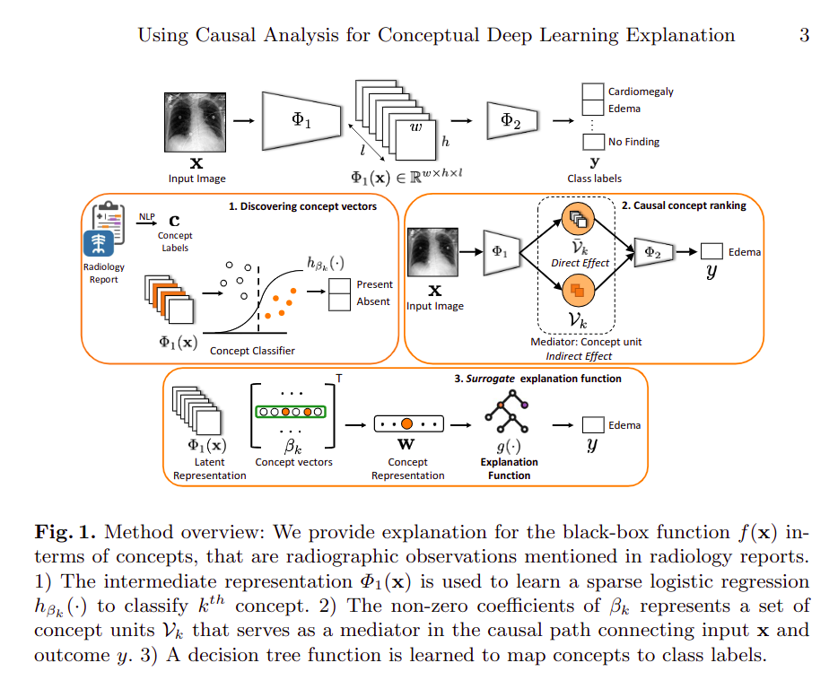
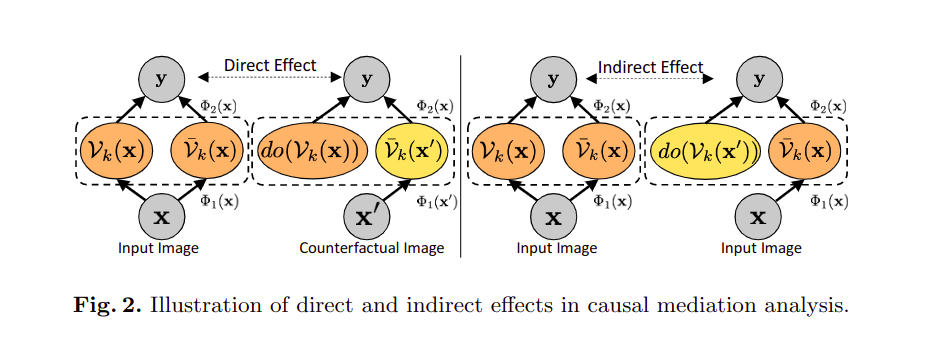
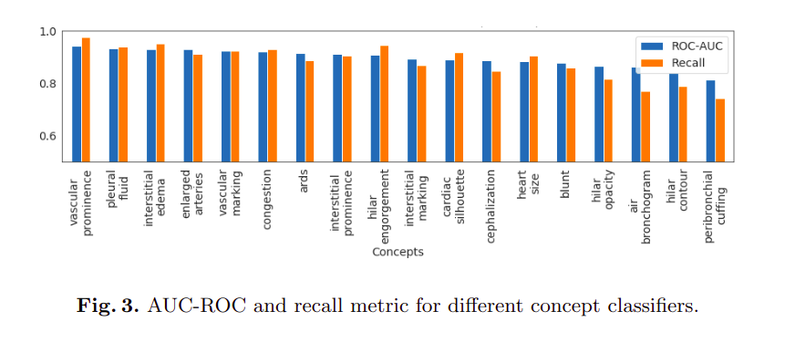
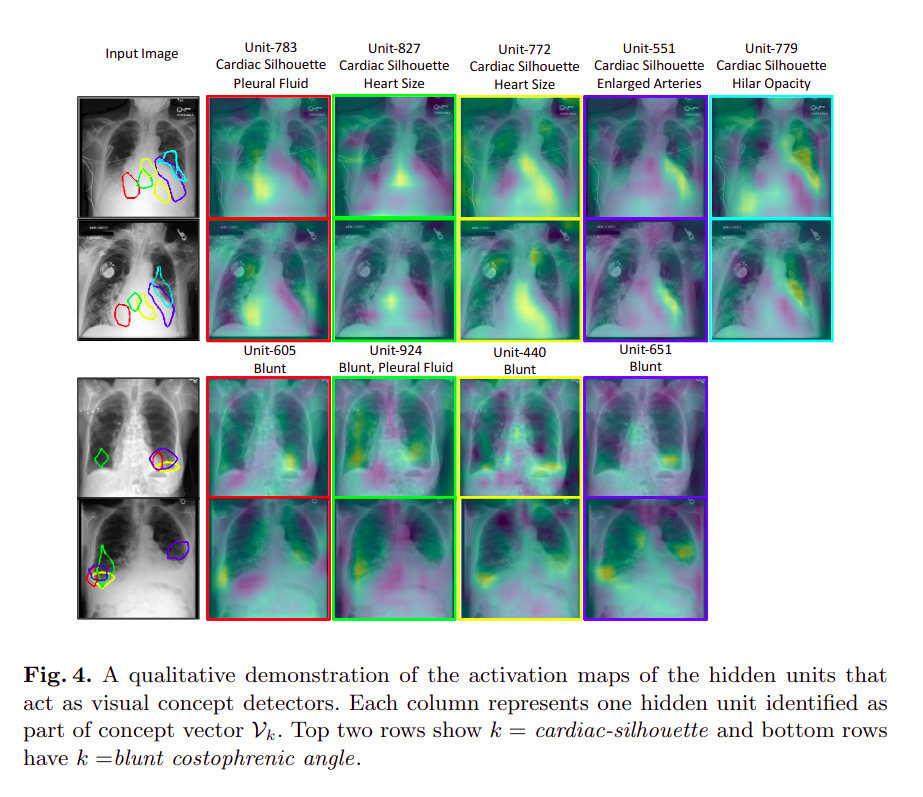
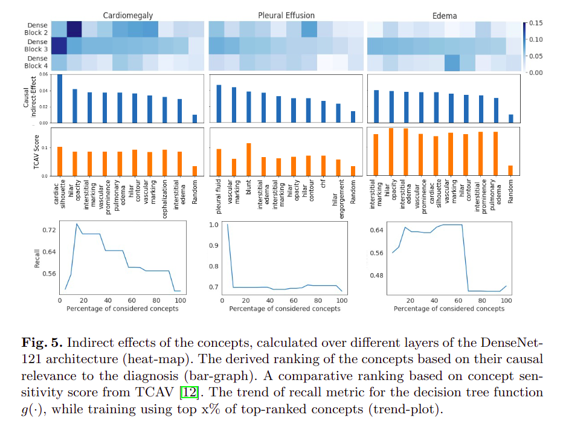
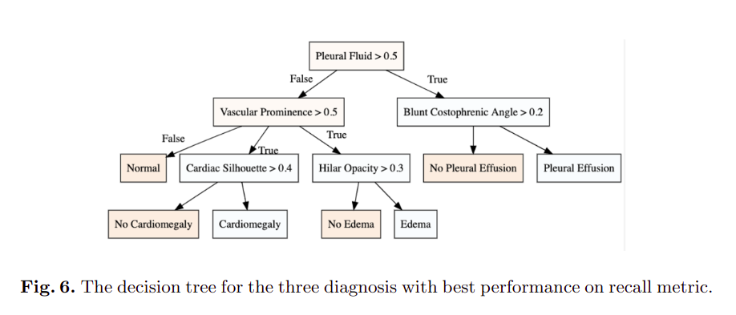

# 
Using Causal Analysis for Conceptual DeepLearning Explanation

&emsp;&emsp;
使用因果分析进行概念性深度学习解释。出自MICCAI 2021: Medical Image Computing and Computer Assisted Intervention – MICCAI 2021 pp 519-528，首次发布于2021年9月21日。[<u>点击此处获得原文地址</u>](https://link.springer.com/chapter/10.1007/978-3-030-87199-4_49#citeas)。

&emsp;&emsp;paper主要工作对医疗中机器学习模型(Dense Net-121)进行了解释，解释的过程类似领域专家的决策。采用了因果推理中的工具（反事实干预），构建了一个决策树，最后在一个大型胸片数据集评估了方法，得到了一致的全局解释。

## 问题背景：

&emsp;&emsp;
机器学习尤其是深度学习方法越来越多应用于医疗保健领域。模型的可解释性对于建立人工智能系统的信任和接受临床医生的反馈至关重要。但实际模型的应用中，模型本身是个黑盒，只能看见两端，即输入和输出，要解释如何以及为什么所识别的区域的变化与模型的决策有关非常困难，该paper构建了一个简单的基于规则的模型，部分解释了黑盒模型。

&emsp;&emsp;基于特征归因的方法已普遍用于解释医学成像的深度学习模型，但是特征归因和放射学概念的一致性很难实现，特别是单个区域对应多个放射学概念。当前的方法主要缺点是依赖于显式的概念标注，以一组代表性的图像或者语义分割的形式作为学习解释，往往这种标注的获取成本在医学领域很高。

## 方法：
&emsp;&emsp;
paper采用来自放射学报告的弱标注导出概念标注。具体方法为使用放射学报告提到的放射学特征定义概念，利用NLP技术从文本中提取弱标注，根据正面提及和负面提及进行分类，然后使用稀疏逻辑回归来识别与概念相关的隐藏单元集。为了量化概念单元对模型的因果影响，paper将概念单元视为treatment-mediator-outcome架构中的一个中介。根据概念与模型的因果相关性提供了一个概念排名，最后构建一个基于规则的决策树为模型提供全局解释。

&emsp;&emsp;
预训练黑盒分类器$f:x\rightarrow y$,输入$x$是图像，使用一系列隐藏层对其处理产生最终的输出$y\in R^D$。为了方便理解，将分类器$f$看作$\Phi_2\circ\Phi_1(x)$。其中$\Phi_1$是网络前几层，$\Phi_2$是网络剩余的部分。假设数据集为$\chi=\{(x_n,y_n,c_n)\}^N$,其中$x_n$为输入图像，$y_n$为对应图像标签的$d$维one-hot编码，$c_n\in\R^k$，表示$k$维概念标签向量。paper将概念定义为放射学报告提到的放射学观测，以描述和提供诊断推理。paper利用NLP pipeline提取概念标注。提取的$c_n$取值为0、1和-1，分别对应的意义为负面提及，正面提及和不确定或缺少提及。

&emsp;&emsp;
paper方法主要由以下三个连续的步骤组成：  
>(1). [***Concept associations***](#concept-associations) : 试图发现概念与隐藏单元$f(\cdot)$之间的稀疏关联，将第$k$个概念表示为$\beta_k\in\R^L$，代表着$\Phi_1(\cdot)$空间中的一个线性方向。   
(2). [***Causal concept ranking***](#causal-concept-ranking) : 使用因果推理工具，发现了基于概念与分类决策的相关性对概念进行排序。具体做法是将每个概念视为输入和结果之间因果路径的中介，以概念相关性作为衡量标准，利用反事实干预间接通过概念中介对结果进行影响。  
(3). [***Surrogate explanation function***](#surrogate-explanation-function) : 学习一个易于解释的函数$g(\cdot)$，在其决策过程中模仿$f(\cdot)$。利用该函数，试图获得对$f(\cdot)$的在概念上的全局解释。

具体见下图：

### Concept associations  
&emsp;&emsp;
通过学习一个二分类模型将$\Phi_1(x)$映射到概念标签，表示$\Phi_1(\cdot)$与概念的关联。将每个概念视为一个单独的二元分类问题，并且提取一组具有代表性的图像集$\chi^k$，其中有概念$c_n[k]$和一个随机的负集。定义概念向量$\beta_k$为逻辑回归模型$c_n[k]$的解。  

 

$c_n[k]=\sigma(\beta_k^T vec(\Phi_1(x_n)))+\epsilon.$ 

$\epsilon$为噪声，$\sigma$为sigmod函数。原先$\Phi_1(x)\in\R^{w\times h\times l}$，$w$为宽度，$h$为高度，$l$为通道数。此处在实验中先将$\Phi_1(x)$reshape为$whl$维向量，然后沿宽度和高度进行最大池化获得$l$维向量。使用lasso回归确保选择稀疏特征，最小化以下损失函数：
 

$\min\limits_{\beta_k}\sum\limits_{x_n\in\chi_k}\ell(h_{\beta_k}(x),c_n[k])+\lambda||\beta_k||_1.$ 

其中$\ell$为交叉熵函数，$h$为预测输出，$\lambda$为L1正则化系数，此处选用L1正则化能促进稀疏。

### Causal concept ranking
&emsp;&emsp;为了能够因果推理，paper首先定义反事实$x^{'}$作为输入图像$x$的扰动，借用了Peral对直接影响和间接影响的的定义，如下图：

其中概念集$\nu^k$为中介，代表第$k$个概念。paper将$\Phi_1(x)$分解为两部分,$\nu_k(x)$和其补集$\bar{\nu_k}(x)$。输出可表示为$f(x)=\Phi_2(\Phi_1(x))=\Phi_2(\nu_k(x),\bar{\nu_k}(x))$。使用条件生成对抗网络学习反事实扰动。将概念视为输入到结果的因果路径中的中介，制定了以下指标量化反事实扰动的因果效应以及中介在其中的作用：  

1).**Average treatment effect (ATE)**: ATE刻画分类结果总体的变化，定义为事实和反事实分类结果之间的比列差异，计算如下：
 

$ATE =\mathbb{E}[\frac{f(x^{'})}{f(x)}-1].$ 

   

2).**Direct effect (DE)**:为了区分直接影响和间接影响，引入了do-operation概念，具体就是在计算直接影响时，先向模型输入原$x$并保持$\nu_k$状态，并记录输出$f(x)$，然后输入$x^{'}$,此时$\nu_k$进入do模式，维持原先状态，更新$\bar{\nu_k}(x)$，得到输出$f(x^{'})$，参照ATE公式计算即可得到DE。其主要捕获输入图像的扰动在不考虑给定的概念下如何改变分类决策。

3).**Indirect effect (IE)**: 其主要捕获输入图像的扰动如何通过给定的概念间接改变分类决策，与DE过程相似，不同的是两次的输入都是原$x$，第二次的$\nu_k$维持输入为$x^{'}$的状态。

&emsp;&emsp;如果扰动对中介无影响，那么因果间接效应为0。该paper采用间接影响作为分类决策相关性的度量。

### Surrogate explanation function
&emsp;&emsp;
在此处的目标是学习一个代理函数$g(\cdot)$，使用一个可解释的直接函数来复现$f(\cdot)$的结果，该paper代理函数为决策树，作者这样考虑是因为很多临床的诊断的程序遵循基于规则的模式。paper将函数$f(\cdot)$总结为$k$概念的回归函数$h_{\beta_k}(\cdot)$，如下：
 

$w_n=[,logit(h_{\beta_1}(x_n)),logit(h_{\beta_2}(x_n)),\cdots].$ 

   

拟合一个决策树函数$g(\cdot)$的结果为：
 

$g^*=\arg\min\limits_{g}\sum\limits_{n}\mathcal{L}(g(w_n),f(x_n)).$ 

   

$\mathcal{L}$基于最小熵的分裂原则以获得每次分裂最高信息增益。

## 实验
&emsp;&emsp;
先总结与跨分类器不同层的不同概念相关的间接影响，根据概念对分类决策的因果贡献进行概念排名，最后使用排名靠前的概念以决策树的形式学习替代解释函数$f(\cdot)$。实验在MIMIC-CXR数据集上进行，采用了SOTA模型DenseNet-121架构用于分类功能。DenseNet-121四个dense block组成，paper用三个版本的$\Phi_1(\cdot)$代表网络的第一个、前两个和前三个dense block。对于概念标注，paper考虑了经常在放射学报告中病理标注的上下文中提及的放射学特征。最后使用斯坦福CheXpert去提取和分类从公开的放射学报告中的observation。实验的结果表明将第三个dense block作为中间能获得最好的性能，以下为不同概念分类的testing-ROC-AUC和回归率：

以下为概念的可视化：

&emsp;&emsp;paper通过间接施加的反事实干扰得到概念的排名，并对概念排名进行了验证，通过对比TCAV的概念相关性实验，证明了其排名结果的合理性：
  
最终选取了排名较好的concept构建了如下的决策树：
  
但是作者在paper中没有写出对决策树性能的验证。

## 个人感悟：
&emsp;&emsp;
这篇paper创新地将因果推理应用于对深度学习模型的解释。在获取放射学标注困难的情况下，使用nlp相关技术从弱标注中提取出训练所需要到的标注。最终实验选取出最优$\Phi_1(\cdot)$，中间concept可以看作是特征，这部分的工作给了我一个启发，该方法可以应用于知识蒸馏，通过一个小模型去拟合最优$\Phi_1(\cdot)$，最后将小模型的输出直接传至$\Phi_2(\cdot)$，或者可以直接将$\Phi_1(\cdot)$和$\Phi_2(\cdot)$都替代为两个较小的模型。相对于TCAV的概念相关性，作者引入了概念的排名，这个排名依据于反事实干扰下的间接影响，在今后的工作中，如果我们想获得某些特征对于最终输出的影响的大小比较，可以参考本文作者的做法。
