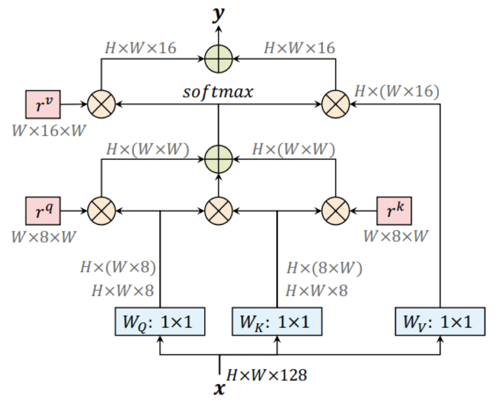
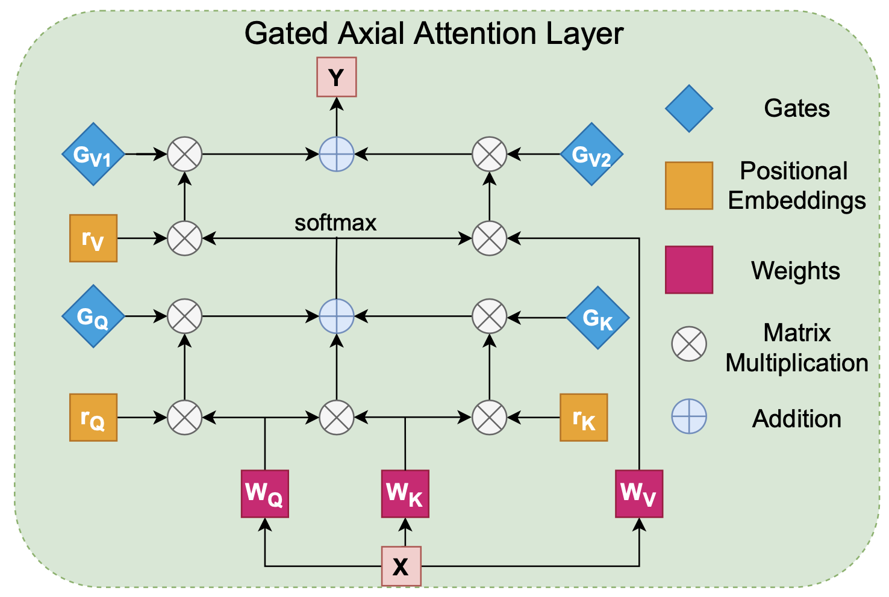
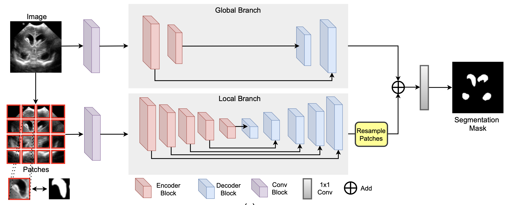
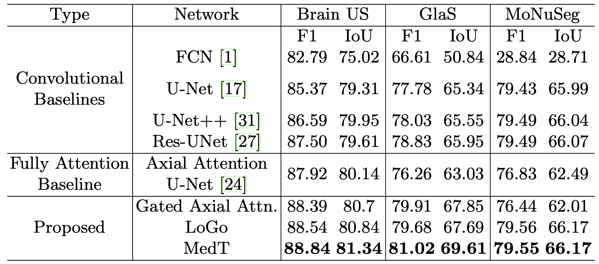

## Medical Transformer: Gated Axial-Attention for Medical Image Segmentation

By Adler Xu

#### 1. Introduction

卷积网络存在一个问题，即他们缺乏对图像中存在的长期依赖性进行建模的能力。在卷积神经网络中，每个卷积核只关注整个图像中像素的局部子集，从而对图像的整体性有一个缺失的理解，并且让网络更加的关注局部的pattern而不是整个的context。

- image pyramids, atrous convolutions and attention mechanisms都可以用来建立long-range dependencies的模型，并作出一定的优化。本文关注的是在医学图像分割任务上来建立long-range dependencies模型

随着Transformers在NLP领域的应用，其 self-attention机制可以发现给定顺序输入之间的依赖关系，后来Transformers的被用于计算机视觉应用程序。在医学图像分割中，基于Transformer的模型还没有得到太多探索，因为基于transformer的模型只有在大规模数据集上训练时才能有很好的效果，而在医学数据集上可用于集中进行训练的带有相应标签的图像数量**相对稀少**，并且贴标签过程也很昂贵并且需要专业知识，因此，学习positional encoding for the images的时候会出现问题。

- 所以本文提出了一个 gated position-sensitive axial attention mechanism：引入了**四个门**来控制the positional embedding提供给**key, query and value**的信息量。这些门是能学习的参数，使Gated Axial-Attention机制适用于任何大小的任何数据集。

#### 2.Contributions

1.提出了一种**gated position-sensitive axial attention**机制，即使在**较小的**数据集上也能很好地工作

2.介绍了适用于 Transformer 的有效的**Local-Global (LoGo)**训练方法

3.提出了建立在上述两个概念之上的 **Medical-Transformer (MedT)**

#### 3. Axial-Attention到Gated Axial-Attention

1. Axial-Attention

为了克服计算affinities的复杂性，self-attention被分解为两个模块。第一个模块在feature map height axis上执行自注意力；第二个在width axis上操作，这两个被称为axial attention。因此，当分成了height axis和width axis之后，可以有效地模拟原本的self-attention机制，将位置偏差编码到机制中，能够在输入特征图中编码long-range interaction，同时在计算non-local context的时候有更好的计算效率。

这些位置编码通常可以通过训练学习，并且已被证明具有编码图像空间结构的能力。

对于任何给定的输入特征图 x，带有positional encodings和width axis的updated self-attention mechanism可以写为：

 $$y_{ij}=\sum\limits_{w=1}^{W}softmax(q_{ij}^Tk_{iw}+q_{ij}^Tr_{iw}^q+k_{iw}^Tr_{iw}^k)(v_{iw}+r_{iw}^v)$$

这个公式描述了沿**张量宽度轴**的axial attention，类似的公式也可以应用于沿**张量长度轴**，他们一起形成了一个计算效率高的单一self-attention模型。

2. Gated Axial-Attention

但是基于self-attention的模型是在**大规模**分割数据集上评估的，因此轴向注意力更容易学习到 key, query and value的位置偏差。

对于小规模数据集的实验（医学图像分割中经常出现的情况），位置偏差很难学习，因此在long-range interactions时并不总是准确的。在学习到的相对位置编码不够准确的情况下，将它们添加到相应的 key, query and value tensor会导致性能下降。因此，本文提出了一种改进的轴向注意块，可以控制位置偏差在non-local context中的影响。

应用在width axis上的自注意力机制可以正式写为：

 $$y_{ij}=\sum\limits_{w=1}^{W}softmax(q_{ij}^Tk_{iw}+G_Qq_{ij}^Tr_{iw}^q+G_Kk_{iw}^Tr_{iw}^k)(G_{V_1}v_{iw}+G_{V_2}r_{iw}^v)$$

比原来的增加了gating mechanism，并且$$G_Q,G_K,G_{V_1},G_{V_2}$$都是可以学习的参数，他们一起组成了gating mechanism，如果位置编码的误差小，那么gating mechanism将会赋予参数更好的权重，以便更好的学习。

[Gated Axial Attention layer which is the basic building block of both height and width gated multi-head attention blocks found in the gated axial transformer layer.]

这个图说明了在一个 gated axial attention层中的前反馈

#### 4.Local-Global Training (LoGo)与Medical Transformer (MedT)

为了提高对于图像的整体理解，可以在网络中使用两个分支

- global branch：处理图像原始分辨率
- local branch：处理图像的patches

在global branch中，减少gated axial transformer的层数，因为在提出的模型中的前几个block已经足够去对long range dependencies来进行建模了
在local branch中，将图像分成16个patches，每一个的大小是I/4 × I/4，其中I是原始图像的尺寸。每个patch是前反馈的，输出特征图根据它们的位置重新采样以获得输出特征图，然后将两个分支的输出特征图相加并通过 1×1 卷积层以产生output segmentation mask。
global branch处理high-level的信息，local branch处理更精细的细节信息，所以这个策略可以提高性能。

Medical Transformer (MedT)用 gated axial attention层作为基本构建块，用LoGo策略来训练，架构如图。

[The main architecture diagram of MedT which uses LoGo strategy for training.]

#### 5.实验与结果

用预测和真实值之间的cross-entropy (CE) loss来训练网络：

$$L_{CE(P,Pˆ)}=-{[\frac{1}{wh}}\sum\limits_{x=0}^{w-1}\sum\limits_{y=0}^{h-1}(p(x,y)log(pˆ(x,y)))+(1-p(x,y))log(1-pˆ(x,y))]$$

w和h是图像的维度，p(x, y) 对应于图像中的像素，pˆ(x,y) 表示特定位置 (x, y) 的输出预测

Baseline

- 卷积：fully convolutional network(FCN)，U-Net，U-Net++，Res-Unet
- transformer-based：Axial-Attention U-Net

在gated axial attention网络中，用gated axial attention layers来代替axial attention layers；在LoGo中，不用gated axial attention layers进行local-global训练；在MedT中，用gated axial attention作为global branch基本构建块和没有local branch位置编码的axial attention

分数比较

对于像 Brain US 这样的图像相对较多的数据集，fully attention baseline比convolutional baselines表现更好；对于 GlaS 和 MoNuSeg 数据集，convolutional baselines比fully attention baseline表现更好，因为数据不够的时候，很难训练fully attention models。

本文提出 gated axial attention 和 LoGo 均优于 convolutional baselines 和 fully attention baseline，并且MedT更是比gated axial attention 和 LoGo 分别的性能都要好（毕竟是结合了两者的）。

与用fully attention baselines的三个数据集相比，MedT的改进优化分别是0.92%, 4.76 % 和 2.72 % ；与用convolutional baseline三个数据集中最好的结果相比，MedT的改进优化分别是1.32 %, 2.19 % 和 0.06 %

#### 6.结论

本文使用了transformer-based的架构来用作于医学图像分割。具体就是用了一个gated axial attention layer，LoGo训练策略，还有一个结合了axial attention和LoGo策略的Medical Transformer。

与其他的transformer-based模型不同的是，文章中提出的方法不需要在大规模数据集上进行预训练！