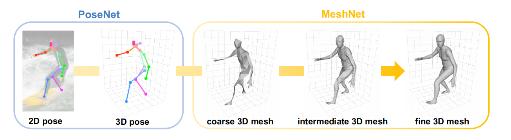
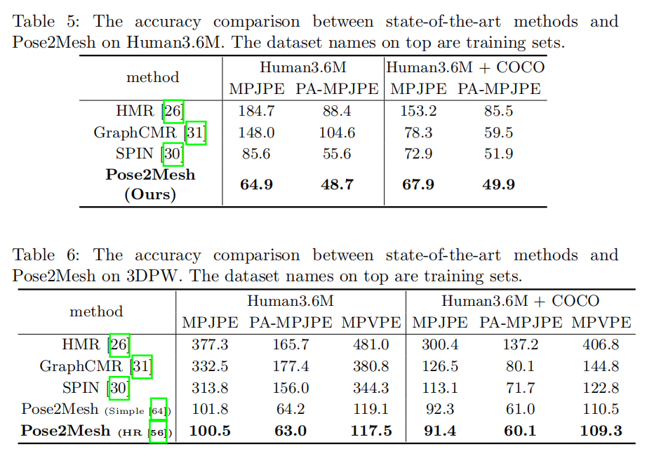
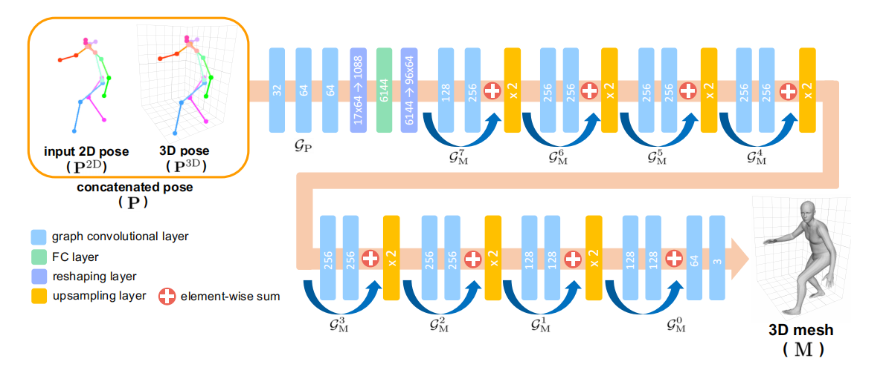

# 
Pose2Mesh：Graph Convolutional Network for 3D Human Pose and Mesh Recovery from a 2D Human Pose

胡惠杰

## 1、论文概述
&emsp;&emsp;本论文是提出了一种名叫Pose2Mesh的模型，用于生成图片的三维pose和mesh。pose是一种用点和线来呈现人体姿势的模型，mesh是用三维化网格来呈现人体姿势的模型。深度学习算法被广泛应用于这一领域，但是现阶段的各种算法还存在两大问题：

- 现阶段的训练数据多半是环境受限的数据，即在实验室环境中采集的图片，但是所训练出的模型在一些复杂背景中进行pose或者mesh模型生成就不能表现很好。
- pose参数不能很好应用于回归，因为存在三维旋转的问题。很多人引入了一个旋转矩阵去避免周期性，但是还是存在非最小化的问题。

&emsp;&emsp;本文提出的模型就能在这两方面表现优异。现阶段生成人体mesh模型的方法可分为依赖于模型的和无模型的，Pose2Mesh就是一个无模型的方法。Pose2Mesh是一个图卷积系统，它直接由回归生成mesh的节点坐标数据，从而避免第二大问题。它是一个级联结构，包含PoseNet和MeshNet两部分，整体的流程如图一所示：

 

&emsp;&emsp;在PoseNet中，先由二维的pose变为三维的pose。在MeshNet中，把二维和三维的pose作为输入，然后通过持续的上采样，由粗到细构建三维的mesh。

### 1.2 PoseNet
&emsp;&emsp;把人的盆骨作为root joint，在训练阶段，在groundtruth上引入现实误差，作为输入，表示为$\mathbf{P}^{2D}$。然后对$\mathbf{P}^{2D}$进行标准正则化，变为$\mathbf{\overline{P}}^{2D}$，为的是消除位置和大小的影响。然后将$\mathbf{\overline{P}}^{2D}$通过一个全连接层转换为4096-d的特征向量，将其馈送到两个残余块，由一个全连接层输出$3\mathcal{J}$-d的向量，即为$\mathbf{P}^{3D}$。

&emsp;&emsp;在PoseNet中，定义损失函数并通过最小化损失函数来训练模型：
$$L_{pose}=\parallel \mathbf{P}^{3D}-\mathbf{P}^{3D^{*}}\parallel_{1}$$
$\mathbf{P}^{3D}$：预测的3D pose  
$\mathbf{P}^{3D^{*}}$：groundtruth的3D pose

### 1.3 MeshNet
&emsp;&emsp;把二维和三维的pose作为输入，用谱图卷积，即通过定义在傅里叶域里信号与滤波器的乘法来实现，然后生成三维的mesh。
$$g_{\theta}*x=Ug_{\theta}U^Tx$$
$U$: 正则化的拉普拉斯算子的特征向量  
$U^Tx$: $x$的图傅里叶变换

&emsp;&emsp;然后就能构建一个图$\mathbf{P}$，作为输入，记为$F_{in}$，包含节点集和邻接矩阵，节点表示人体的joint，临界矩阵权值为0或1，表示joint连接与否。然后定义正则化的拉普拉斯算子与规模化的拉普拉斯算子。然后再用到谱图卷积输出经卷积处理后的$\mathbf{P}$，记为$F_{out}$。本文的MeshNet选取三层的图卷积层处理。紧接着，图不断进行上采样，对mesh进行由粗到细的细化。

&emsp;&emsp;在MeshNet中定义了四个损失函数：
- vertex coordinate loss
$$L_{vertex}=\parallel \mathbf{M}-\mathbf{M}^{*}\parallel_{1}$$
&emsp; $\mathbf{M}$：predicted 3D mesh coordinates   
&emsp; $\mathbf{M}^{*}$：groundtruth

- joint coordinate loss
$$L_{joint}=\parallel \mathcal{J}\mathbf{M}-\mathbf{P}^{3D^{*}}\parallel_{1}$$

- surface normal loss
$$L_{normal}=\sum_f{\sum_{\{i,j\}\subset f}{\lvert \lang \frac{\mathbf{m}_i-\mathbf{m}_j}{\parallel \mathbf{m}_i-\mathbf{m}_j \parallel_2},n_f^*\rang \rvert}} $$

- surface edge loss
$$L_{edge}=\sum_f{\sum_{\{i,j\}\subset f}{\lvert \parallel \mathbf{m}_i-\mathbf{m}_j \parallel_2-\parallel \mathbf{m}_i^*-\mathbf{m}_j^* \parallel_2 \rvert}}$$

## 2、实验
&emsp;&emsp;用到了**Human3.6M**、**3DPM**、**COCO**、**MuCo-3DHP**、**FreiHand**数据集作为训练和测试。其中部分数据集的groundtruth不全面覆盖三维的情况，本文作者借用别的模型的结果作为伪groundtruth。

&emsp;&emsp;设计消融实验（3个不同的对照组）证明图卷积网络的作用，对比了采用不同训练算法的模型，结果是在大多数时候基于图卷积的Pose2Mesh能发挥更好的效果。然后对比了由粗到细的mesh上采样和直接上采样的效果，结果是前者的计算速度和joint错误更少。然后为了验证级联结构的有效性，考虑直接输入二维和三维pose数据，结果都不如级联结构表现好。

&emsp;&emsp;在多个数据集上，Pose2Mesh的表现都优于已发表的性能最佳的算法模型，尤其是在复杂环境下的对图片进行pose和mesh的构建。

 

## 3、知识整理
### Cascaded architecture

&emsp;&emsp;Cascaded architecture是级联结构，级联设计模式解决了一个机器学习问题可以合理的分解为一系列ML问题的情况。

&emsp;&emsp;级联结构的学习速度非常快，网络可以确定自己的大小和拓扑结构，即使训练集发生变化，它仍保留其构建的结构，并且不需要误差信号的反向传播。通俗来讲，级联结构就是将相同(或类似)结构的操作(模块)连接在一起，以实现1+1>2的效果。

### unsampling

&emsp;&emsp;上采样简单的理解就是把图片进行放大了。在算法中，在我们做图像识别过程中，需要对图像进行像素级别的分类，因此在卷积提取特征后需要通过上采样将feature map 还原到原图中。在算法中常见的上采样方法有双线性插值以及转置卷积、上采样(unsampling)和上池化(unpooling).

&emsp;&emsp;在本文的Pose2Mesh模型中，如图：

 

&emsp;&emsp;通过不断上采样，可以实现mesh的细化，本文采用的a nearest-neighbor upsampling function，即最近邻插值法进行上采样，用公式表示为：
$$F_c=\psi (F_{c+1}^T)^T$$
&emsp;&emsp;其中$\psi$就是最近邻插值上采样函数，$F_c$和$F_{c+1}$是相邻的分辨率的图的相邻的feature map

## 4、个人心得
&emsp;&emsp;本文验证了图卷积和级联结构用在从图片构建三维网格模型这一工作上的优越性。本文的Pose2Mesh是一个无模型的算法，在克服复杂环境的影响上表现比较好。对于级联机构和上采样的算法细节，我还不甚清楚，后续补上。