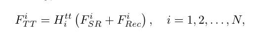
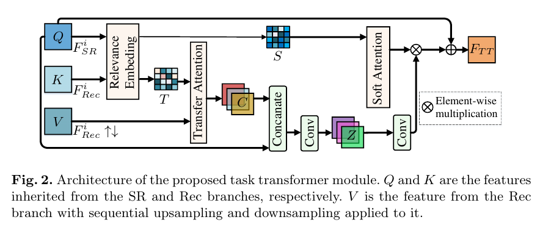
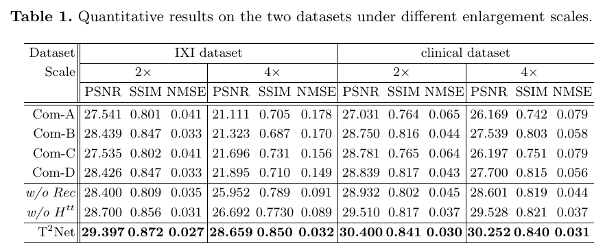
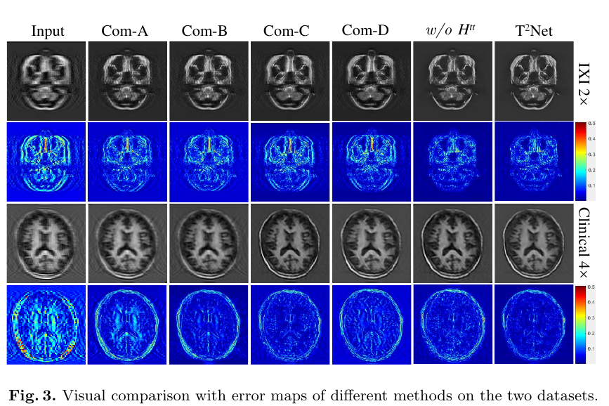

## abstract

[Task Transformer Network for Joint MRI Reconstruction and Super-Resolution
](https://arxiv.org/abs/2106.06742)

1. mri 的一个核心问题是速度和质量二者不可兼得，目前的方法的设计都是分开考虑，不考虑二者联系；
2. 超分辨率和 mri 重建是 mri 的两个重要研究手段或者说方向；
3. 这篇文章提出了端到端的 task transformer network ($\text{T}^\text{2}\text{Net}$)，联合两个任务重建和超分辨率，让特征在两个任务中共享，目的来实现高质量、超分辨率的、无运动伪影的图片；
4. 整个网络设计结构：先用 CNN 提取 task-specific features, 然后通过一个 task transformer 模块来联系两个分支；

mr 扫描的数据填充到 k 空间，从 k 空间采样得到数据，然后通过反傅里叶变换得到 mri 图像。

图像重建 image reconstruction和图像超分辨率是MRI的两个主要技术。前者通过减少 k 空间采样率来加速 MRI。后者通过恢复单个退化的低分辨率 (LR) 图像获得高分辨率 (HR) 图像。

现有方法分别执行这两个任务，忽略了它们之间的关系。

这篇文章提出Task transformer network，共同执行图像重建和图像超分辨率，允许多个任务之间共享表示和特征变换。利用一个任务的知识加速另一个任务的学习过程。

## introduction

1. 重建和超分辨率已经有很多优秀的方法；比如[感知压缩](https://www.zhihu.com/question/28552876)、低秩约束、[字典学习](https://www.cnblogs.com/endlesscoding/p/10090866.html）、manifold fitting 等技术被运用到 mri 重建，其利用先验知识来克服因违背香农采样而导致的混叠伪影。
2. 深度神经网络被广泛应用，不同 CNN 方法被用来进行快速 mri 重建；典型例子：model-based unrolling methods，如$\text{VN-Net}$, $\text{ADMN-Net}$；端到端方法，如基于 U-Net, GAN。
3. 对于超分辨率，一些迭代算法如 low rank 或 sparese representation（稀疏表示），将 image priors（deep image priors？）考虑为正则项，然后通过低分辨率图片获取更高质量图片。类似的，CNN 方法也在超分辨率任务上实现了sota的结果，比如残差学习提取多尺度信息，或者基于 GAN 从低分辨率输入获得高分辨率输出。
4. multi-task learning 在自然语言处理、语音识别、计算机视觉等领域都取得了一定的成功

基于 transformer 和 multi-task learning，本文提出$\text{T}^\text{2}\text{Net}$，结合重建和超分辨率两个任务。

本文贡献有三：
1. 第一个把 transoformer 引入到重建和超分辨率的 multi-task learning 中；
2. 网络结构，下文将具体阐述
3. 相比各种 sota 的 重建和超分辨率的 sequential combination 模型，本文模型取得更好的结果。

## model

整个框架，包含三部分，SR 分支、reconstruction 分支、task transformer 模块;

两个分支用来获得 task-specific feature，后者用来学习共享特征，鼓励网络学习到一个更加泛化性的表示。

两个分支的输入都是欠采样、退化的 MRI数据，包含运动伪影、模糊。rec 分支的输出是 低分辨率无运动伪影图像$X'_{LR}$，sr 分支的输出是最终的期望的高质量，高分辨率的，且没有伪影的图像。

**sr 分支**

如图所示，输入$\hat{x_{LR}}$是$h/s\times w/s$的，之后通过一个卷积层得到浅层特征$F^0_{SR}$，然后将它送到一个 $\text{EDSR}$的 backbone 里，来提取 SR 特征，这个 backbone 即是上文所说 task-specific，图中就是$H_{SR_i}^{RB}$，为了融合不同任务特征，使用 task transformer module 也就是$H^{tt}$，其将无运动伪影的特征送入到 SR 分支。

如图该 transformer 模块的输入，将作为 sr 分支$H_{SR_i}^{RB}$的输入

整个图对于各个结构展示的很详细。

最后，$x'$通过 sub-pixel convolution 输出得到，整个分支在全采样高分辨率图片 x 的监督下进行训练。

**rec 分支**

单单上述依赖于 SR module 不足以从一个带有伪影的 LR 图片得到高分辨率且无运动伪影的图片。但是通过重建可以去除伪影。

文中有这样一句话`By
comparing the input and output of the Rec branch in Fig. 1, we can easily see
that the Rec branch is more powerful in eliminating artifacts.`

具体结构和 SR 分支很相似；

**Task Transformer Module**

Rec 分支比 SR 分支具有更强的去除伪影的能力，这里的 task transformer 让 SR 分支去学习这种能力，让 SR 分支具有去除伪影的能力。这个模块包含 3 部分：relevance embedding, transfer attention for feature transfer, soft attention for feature synthesis。

图中很详细；

对于 transformer 的 $V$，是$F_{Rec}^{i}$经过上采样然后下采样，文中说是让它和 $Q(F_{SR}^i)$ domain-consistent。

relevance embedding 的目的是计算两个分支的相关性；

transfer attention 为了将 Rec 分支的解剖学结构特征迁移到 SR 分支；传统的 attention 机制，对每个 query 会做重建特征的加权求和，但是这会导致模糊；对于每个 query，为了得到 Rec 分支相关性最强的位置的特征，这里通过前面计算的关联性矩阵来进步一提取特征

soft attention，在图中最右边都可以算作soft attention。这一块的目的就是融合特征。

## experiments

使用 IXI 数据集和临床大脑 MRI 数据；

使用了两个重建的方法和两个超分辨率的方法：$\text{ADMMNet}$和$\text{MICCAN}$，$\text{MGLRL}$和$\text{Lyu}$，通过 sequential combination，得到不同 baseline，进行比较。

$\text{Com-A: ADMMNet-
MGLRL, Com-B: ADMMNet-Lyu et al., Com-C: MICCAN-MGLRL, Com-
D: MICCAN-Lyu et al.}$

## summary

由本文一些概念，慢慢接触到了 mri，然后就去对 mri 进行一个笼统的了解（虽然还是不懂，但是知道了学习的方向，比如基于深度学习的 MRI Reconstruction 和 SR），

首先，按作者所说，这个模型能够在 SR 和 Reconstruction 任务上进行 mutil-task learning，这是它的最大成就。其次，对于这样一个模型为什么能够 work，还没有一个直观理解（因为结果好，所以 work?）。

## reference

1.https://www.jianshu.com/p/f102f4b23b90