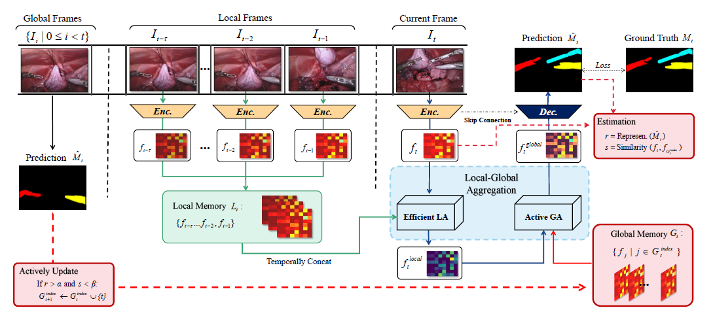
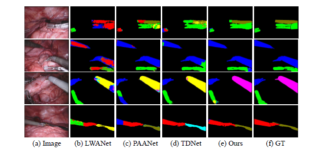
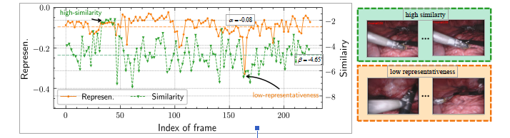

# 
Efficient Global-Local Memory for Real-time Instrument Segmentation of Robotic Surgical Video

## 
11/16 By Jiakun, Wang

## 1.相关背景

&emsp;&emsp;《高效的全局-局部记忆用于机器人手术视频的实时器械分割》出自MICCAI 2021 [论文链接](https://arxiv.org/abs/2109.13593)

&emsp;&emsp;机器人辅助手术极大地提高了外科医生的表现和病人的安全保障。从手术视频中进行实时和准确的器械分割，对于提高机器人辅助手术的性能具有重要意义。快速准确的器械分割可以提高外科医生在进行手术时的情景意识，提供及时的决策支持。

&emsp;&emsp;然而，在手术视频中准确快速的分割器械是非常困难的，因为手术场景复杂，照明条件多样，内窥镜摄像机的小视场导致器械结构不完整和扭曲，以及血液或器械重叠导致的视觉遮挡。大多数现有的关于手术器械分割的方法都将序列视频视为静态图像，而忽略了时间维度上的宝贵线索。

## 2.写作目的

&emsp;&emsp;许多手术视频分析表明，使用长距离的时间信息来提高结果是成功的，主要集中在手术工作流程，手势和工具存在的识别任务上。本文作者将在仪器分割任务中的时间维度上纳入长距离信号以提高仪器分割的鲁棒性和效率。

## 3.解决方案

&emsp;&emsp;本文提出了一种新型的双向记忆网络（Dual-Memory Network，简称DM Net），作者首先设计了一个局部记忆，以采取RNN和自我注意机制的互补优势。考虑到局部范围的帧段表现出相似的空间信息和高度的时间连续性，利用RNN来收集具有小接收场的时间信号，继而利用自我关注的非局部区块来联系更大空间内的当前帧，只收集单一帧。然后进一步开发了一个全局记忆，通过纳入主动学习策略，使当前帧能够有效地获取更长的内容。基于两个样本选择标准，在全局范围内扩散的最有信息量和代表性的帧被选中。将这些帧与当前的特征联系起来，可以在保持快速预测的同时实现充分的信号增强。

## 4.核心思想及创新点

### 4.1网络结构

&emsp;&emsp;器械分割的目标是在视频的每一帧实时产生一个分割图。当前时间步长设为t，双记忆结构包括一个局部记忆和全局记忆，分别定义为$L_t$和$G_t$，由以前的帧中提取的特征图f组成，在图中分别表示为绿色和红色流。本地记忆$L_t$包含从以前的$\tau$个帧中提取的$\tau$个特征图{$f_{t-\tau}$,...,$f_{t-2}$,$f_{t-1}$}，用于局部时间聚合以避免重复计算。全局记忆由有一组从以前所有的帧中选出的特征图组成。从全局记忆中随机选取一定数量的帧来提供依赖关系降低计算成本。又利用主动学习的原理，进一步引入主动更新策略，将最有价值的特征图保存。通过全局和局部的聚合，当前帧的特征被增强以实现精准的仪器分割。

### 4.2局部时空聚合(Local Temporal Aggregation)

&emsp;&emsp;利用视频的时间连续性建立时间模型，特别是来自局部范围内的相邻帧信息，对于提高每一帧的分割效果至关重要。作者提出了一种高效的局部聚集模块(ELA)，利用ConvLSTM操作和非局部关注机制(non-local),将本地记忆中的时间依赖性通过ELA导入来增强每一帧的特征。

- ConvLSTM:出自NIPS 2015 [论文链接](https://arxiv.org/abs/1506.04214)，该文章主要工作为对全连接LSTM(FC-LSTM)进行扩展，使其从输入到状态和状态到状态的转换中都具有卷积结构。ConvLSTM能更好地捕捉时空相关性。

- Non-Local:出自CVPR 2018[论文链接](https://arxiv.org/abs/1711.07971)，该文章工作为在捕捉长距离特征之间依赖关系的基础上提出了非局部信息统计的注意力机制,基于图片滤波领域的非局部均值滤波操作思想，提出非局部操作算子，可以捕获时间，空间和时空的长范围依赖。

&emsp;&emsp;为了分割当前帧$I_t$，首先从局部记忆中形成特征图夹，利用ConvLSTM操作，用小卷积核沿时间维度聚集信息，采用BottleneckLSTM，在输入后设置瓶颈层减少特征维度。利用NL机制扩大参考区域，基于当前帧的编码时间特征$\tilde{f}_t$生成$\tilde{f}_t$的两种特征图(key, value)，表示($\tilde{k}_t$,$\tilde{v}_t$)。将$\tilde{k}_t$中的每个空间位置与其他locations进行比较，进行相似性匹配，相似性函数定义为$\mathcal{F}_{slim}(x,y) = exp(x \circ y)$，其中$\circ$表示点积。ELA模块的计算输出特征如下:
$$f_a^{local_i} = \mathcal{F}_{N L}(\tilde{f}_t)=[\tilde{v}_t,\frac{1}{\mathcal{Z}}\sum_{\vee j}\mathcal{F}_{slim}(\tilde{k}_t^i,\tilde{k}_t^j)\tilde{v}_t^j] $$

&emsp;&emsp;其中，Z是归一化因子；[.,.]表示concatenation operation，i是要计算响应的输出位置的索引，j是列举时间特征图$\tilde{f}_t$中所有可能位置的索引。$f_t$通过沿时间和视觉空间的有效特征聚合，从我们建立的局部记忆中增强到$f_t^{local}$。

### 4.3全局时空聚合(Global Temporal Aggregation)

&emsp;&emsp;除了使用局部时空依赖性来增强当前帧的特征外，作者还建议从全局记忆中引入时间上更遥远的信号。全局时空聚合的标准方法是将所有先前帧的特征图放入全局存储器，并在访问时随机选择一些样本，命名为主动全局聚合（AGA）。引入了两个选择标准，代表性和相似性。给定第t帧的时空聚合图$\hat{M}_t$,通过代表代表性的熵来计算预测的置信度r。由于置信度低的样本更有可能是异常的，造成决策边界的预测，只在r>α的情况下将该帧导入$G_t$,采用负的欧氏距离来衡量一对特征图的多变量相似度。

## 5.实验验证

### 5.1数据集选择

&emsp;&emsp;2017年MICCAI EndoVis仪器挑战赛（EndoVis17）和2018年MICCAI En-doVis场景分割挑战赛（EndoVis18）

&emsp;&emsp;两种常用的评价指标平均相交度（mIoU）和平均Dice系数（mDice）被采用来验证。为了评估模型的复杂性和时间性能，计算了参数的数量（Param.）、FLOPS、推理时间和FPS。

### 5.2实验结果

Fig 1.不同方法在EndoVis17上的类型分割的视觉比较

Fig 2.全局聚合中的视频序列的相似性和代表性

&emsp;&emsp;从绿色方框中看到，具有接近相似性分数的视频序列显示出高相似性的外观。在橙色框中，低置信度的样本由于运动模糊而呈现出异常的外观。使用数据的全局信息，即α和β的平均值作为阈值，AGA模块绕过了这些信息。DMNet实现了最接近地面真相的分割结果，证明了所提出的时间信息聚合方案在处理挑战性案例方面的有效性。

## 6.启发

&emsp;&emsp;该文章所涉及到的非局部机制增加感受野的思想感觉和transformer的自注意力机制很相似，通过生成的特征图计算内积来代表相似度和transformer的q k v矩阵计算相似度本质上应该是一样的，在传统的通过叠加层数增加感受野来获取时空信号会增加巨大的计算成本，我觉得self-attention机制会是一个可能的解决方法。

&emsp;&emsp;在视频的特征图处理上应该尽可能的考虑时间维度上的其他信号，包括局部的相邻帧和全局的更早的帧。本文代码将会抽空复现。

