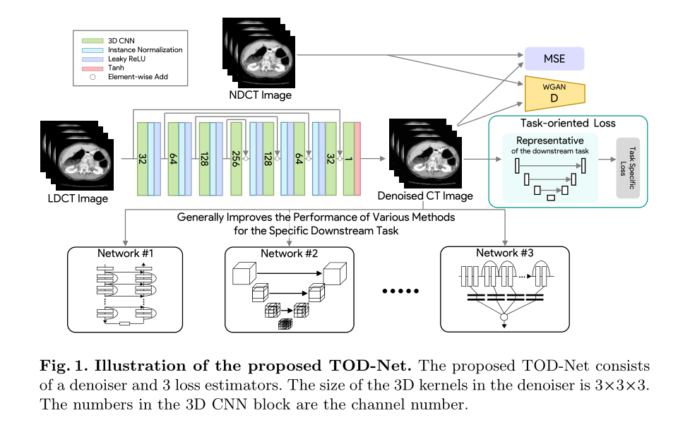
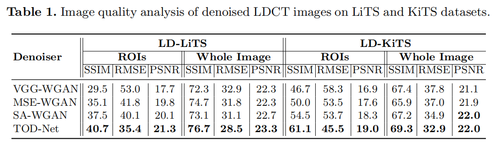
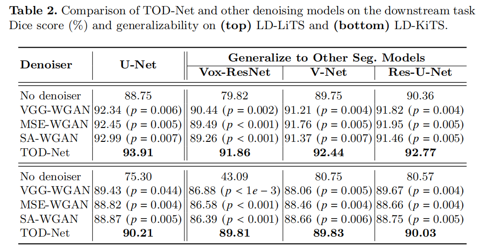
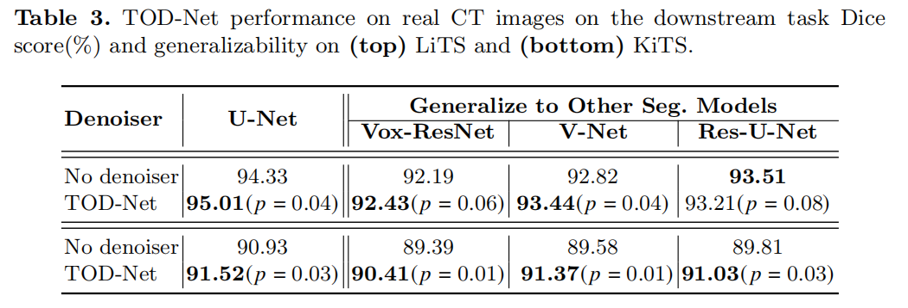
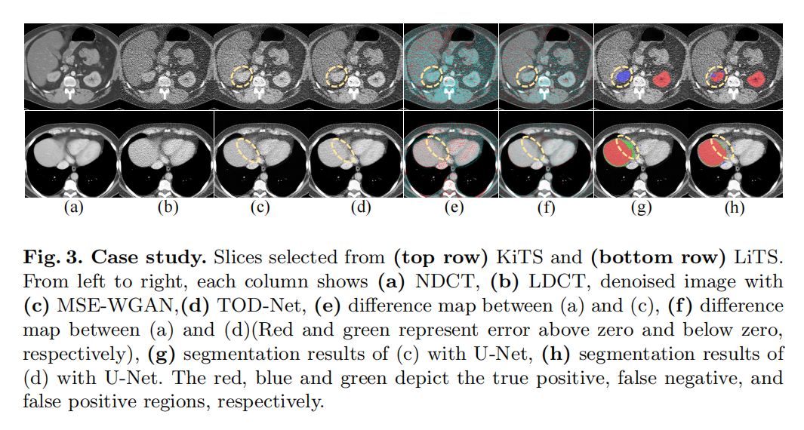

# 
Targeted Gradient Descent: A Novel Method for Convolutional Neural Networks Fine-tuning and Online-learning
 

By Mars Zhang

##论文获取
&emsp;&emsp;《面向任务的低剂量 CT 图像去噪》，Comments:	Paper accepted by MICCAI-2021，Subjects:	Image and Video Processing (eess.IV); Computer Vision and Pattern Recognition(cs. CV),引用格式为：

Chen, J., Asma, E., & Chan, C. (2021, September). Targeted Gradient Descent: A Novel Method for Convolutional Neural Networks Fine-tuning and Online-learning. In International Conference on Medical Image Computing and Computer-Assisted Intervention (pp. 25-35). Springer, Cham.

[代码下载链接](https://github.com/DIAL-RPI/TASK-Oriented-CT-Denoising_TOD-Net)
[论文下载链接](https://arxiv.org/abs/2103.13557)

##论文背景
&emsp;&emsp;医用CT的广泛应用引起公众对CT辐射量的关注，降低辐射剂量会增加CT成像的噪声和伪影，影响了医生的判断和下游医学图像分析任务的性能。近年基于深度学习的方法去噪得到的一定应用，但现有的方法都是与下游任务无关的。本文引入了一种新的面向任务的去噪网络(TOD-Net)，该网络利用了来自下游任务的知识来实现面向任务的损失。通过系列实证分析表明，任务导向损失弥补了其他任务无关损失，通过控制去噪器来提高任务相关区域的图像质量。这种增强反过来又为下游任务带来了各种方法的性能的普遍提高。

##知识梳理
&emsp;&emsp;为了解决上述问题，研究人员开发了各种LDCT传统去噪方法。它们可以分为三类，sihogram滤波，迭代重建和图像后处理。经典的后处理方法包括K-SVD、非局部均值(NLM)和3D块匹配(BM3D)。各种深度神经网络被提出去噪LDCT图像，成为主流方法。Chen等人首先提出了3层卷积神经网络(CNN)的训练，以最小化均方误差(MSE)，用于LDCT后去噪。Yang等人在中引入了带有感知损失的Wasserstein Generative Adversarial Network(WGAN)，以便在去噪时保留更多细节信息。最近，该领域引入了自我注意机制和自我监督学习方法，以进一步提高成绩。为了缓解噪声给下游任务带来的困难，本工作还重点研究了基于深度学习的图像去噪和下游任务性能提升的后处理方法。
&emsp;&emsp;上述的方法都是下游任务不可知的。具体来说，基于深度学习的去噪方法都旨在减少去噪后的LDCT图像与对应的正常剂量CT(NDCT)图像之间的距离。而本文认为去噪模块应该与下游应用一起训练。这有两个好处，一是利用下游任务需求可以提高任务相关区域的去噪性能。其次这种图像质量增强可以反过来提高下游任务的性能。为了实现此目标，本文在WGAN框架中提出了一种基于任务损失的面向任务去噪网络(TOD-Net)，加入了下游任务的固定代表性网络，并利用其损失来指导TOD-Net的参数优化。
&emsp;&emsp;提出的TOD-Net通过三种损失的组合，从LDCT生成去噪图像。这些损失包括均方误差(MSE)损失，用于控制生成图像与NDCT对应图像之间的全局欧里德距离，用于缩小其分布之间的距离的WGAN的判别器(discriminator)，以及用于反映下游任务相关需求的Task-oriented Loss。下图显示了本文的TOD-Net的概述:

 

- **WGAN for LDCT Denoising**
&emsp;&emsp;$x$代表LDCT图像，$x^*$为对应NDCT图像，WGAN包含一个去噪器$G$和用于在$x^*$分布下生成$\hat{x}=G(x)$判别器$D$，将$x$的分布表示为$Q$，$x^*$的分布表示为$P$，损失WGAN损失函数表示如下：$$ L_D(\theta_D)=\mathbb{E}_{x^*\sim P}[D(x^*;\theta_D)]-\mathbb{E}_{x\sim Q}[D(G(x;\theta_G);\theta_D)];s.t. ||\theta_D||_1\le\epsilon$$ $$L_{GAN}(\theta_G)=\mathbb{E}_{x\sim Q}[D(G(x;\theta_G);\theta_D)]$$
本文采用了Wasserstein distance来描述P和Q的概率分布距离。
- **Analysis of Task-oriented Loss**
&emsp;&emsp;本文提出的任务导向损失是主要创新，是使去噪器在训练阶段具有对下游任务的明确认知。在这种任务导向的指导下，去噪网络将增强下游任务的具体特征，提高整个医学图像处理流程的性能。具体来说，一个下游任务的代表性模型$T$被纳入训练过程中。如上图所示，将去噪后的图像输入模型$T$，计算Task-oriented Loss。在本文中，我们演示了我们的基于医学图像分割任务的TOD-Net。采用Dice loss：$$L_t(\theta_G)=\mathbb{E}_{x\sim Q}[1-Dice(T(G(x;\theta_G)))]$$
- **Training Strategy**
&emsp;&emsp;用于优化去噪剂$G$的总损失为$$L_G=L_{GAN}+L_t+\lambda L_{MSE}$$Task-oriented Loss和MSE的损失共同工作，从而增强了下游任务所需的局部特性，同时保持了较高的全局质量。在每次训练迭代中，两个损失$L_D$和$L_G$交替更新。

##实验 
&emsp;&emsp;从两个方面对TOD-Net的两个数据集进行了评估：1)去噪图像的图像质量，2)以去噪图像作为输入的下游任务的性能。图像质量通过均方根误差(RMSE)、结构相似度指数(SSIM)和峰值信噪比(PSNR)来衡量。下游任务医学图像分割的性能，由Dice score来评估。baseline为VGG-WGAN、SA-WGAN和MSE-WGAN。在两个公开的单器官分割数据集评估了模型，即LiTS (Liver tumor segmentation challenge),和KiTS (Kidney tumor segmentation challenge)。
&emsp;&emsp;本文采用四种不同的分割网络作为我们的下游模型，包括U-Net、V-Net、Res-U-Net和Vox-ResNet。每个分割网络都在LiTS和KiTS训练集上独立进行预训练。在LiTS测试集上，按上述顺序排列的4个分割网络的Dice值分别为94.31%、92.80%、93.51%和92.08%。在KiTS测试集上，这四种分割网络的Dice值分别为90.87%、89.61%、89.78%和89.35%。所有这四个网络都没有获得SoTADice得分（>95%），因为本文的数据分割不同于最初的挑战。作者将挑战训练集划分为训练、验证和测试集。分割模型用更少的数据进行训练，并在不同于原始挑战的测试集上进行评估。定量评估了所提出的TOD-Net的去噪质量为下表：

与其他两种WGAN去噪器相比，TOD-Net在整个图像和ROI(regions of
interest)水平上的所有评估指标中都排名第一。特别提出，TOD-Net在ROI上的图像质量增强甚至比在整个图像上更显著。这验证了来自预先训练的下游模型的信息，Task-oriented Loss局部促进了任务相关区域的图像质量。结合全局正则化的MSE损失，TOD-Net在局部和全局上都取得了最好的性能。

&emsp;&emsp;本文将TOD-Net与四种分割网络进行串联，以评估其对下游任务的影响。对LD-LiTS和LD-KiTS的检测结果下表所示。由于LDCT图像比NDCT图像包含更多的噪声和伪影，直接将NDCT训练的分割模型应用于LDCT图像会导致性能显著下降。

&emsp;&emsp;相比之下，使用去噪图像提高了分割性能。通过Dice scores测量，TOD-Net不仅显著优于所有其他去噪模型(p<0.05)，不仅在TOD-Net训练上，在其他三种分割网络上也是如此。本文通过应用于原始LiTS和KiTS数据集来评估TOD-Net在真实CT图像上的性能。下表的结果显示，TOD-Net对KiTS上的所有分割网络都有了显著的改进。在LiTS上，除了Res-U-Net的性能略有下降外，所有下游网络都表现更好，差异不显著（𝑝>0.05）。

&emsp;&emsp;除了定量分析证明TOD-Net的高性能和高通用性外，本文进一步可视化了Task-oriented Loss所带来的差异。下图显示了两个示例情况。可以看出，在(e)和(f)上，TOD-Net的误差明显小于MSE-WGAN，特别是在ROI上，在(h)和(g)得到更好的分割结果。

##个人观点
&emsp;&emsp;本文针对现有深度学习方法图像去噪中忽视下游任务问题上，在WGAN框架基础上，提出了结合下游任务同时训练的去噪模型，建立了Task-oriented Loss，十分具有启发性。该方法同样可以迁移至很多其他上游任务处理，而不是仅仅局限于图像去噪上。