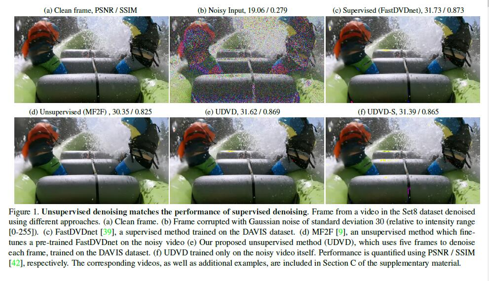
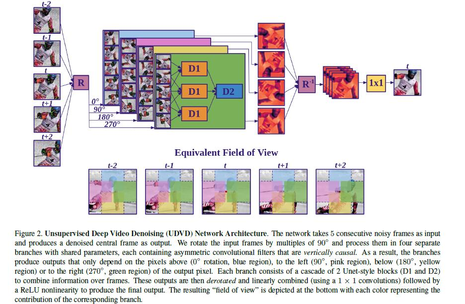
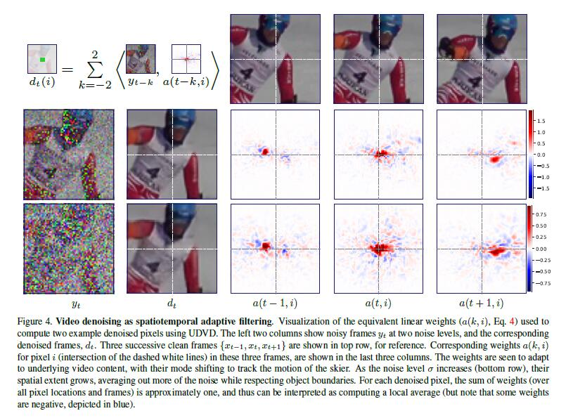
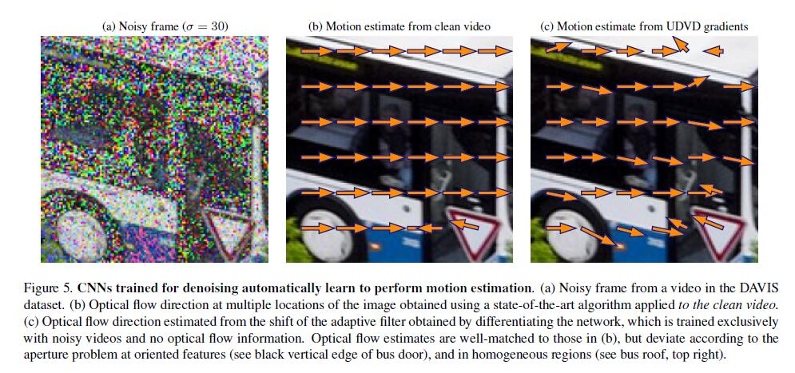
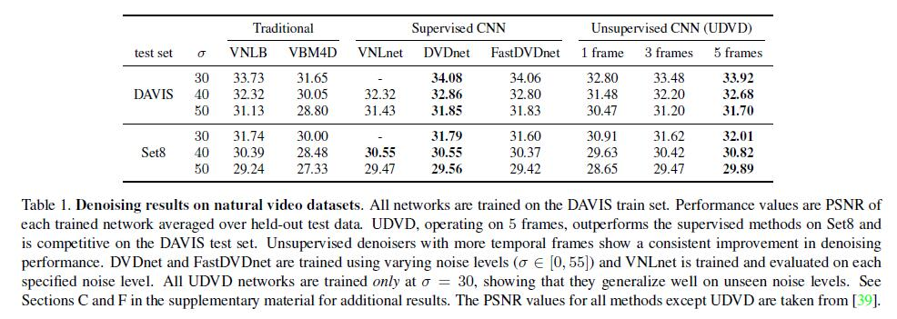
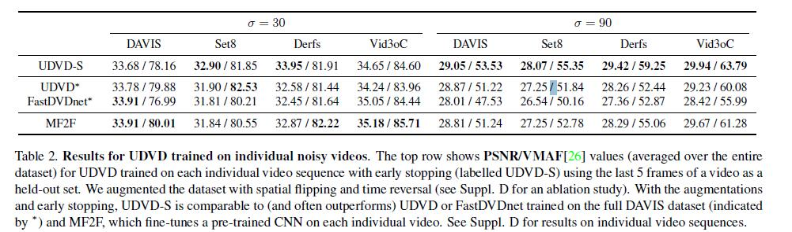
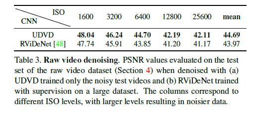
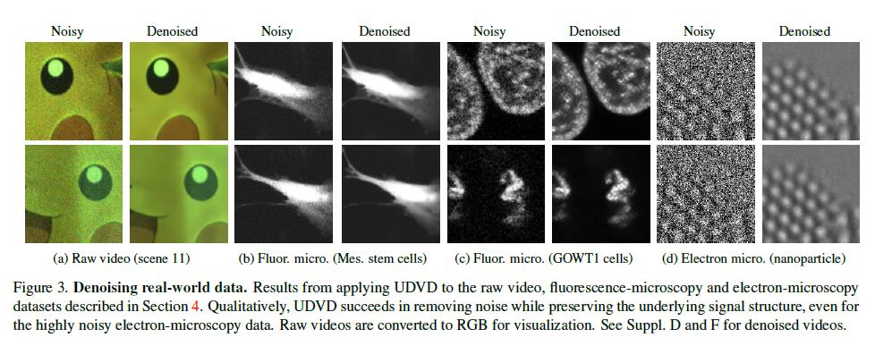

# 
Unsupervised Deep Video Denoising

#### 
By David Wang

## 1. 论文简述
&emsp;&emsp;《无监督的深度视频去噪》 选自 ICCV 2021 ，引用格式为(APA)：  
Sheth, D. Y., Mohan, S., Vincent, J. L., Manzorro, R., Crozier, P. A., Khapra, M. M., ... & Fernandez-Granda, C. (2021). Unsupervised deep video denoising. In Proceedings of the IEEE/CVF International Conference on Computer Vision (pp. 1759-1768).  
&emsp;&emsp;本篇论文首先提出要解决的问题：当前视频去噪领域最为先进的方法是使用CNN网络，但需要使用干净的数据做训练。在诸如显微镜的应用中，无噪音的ground truth视频往往是不可用的。为了解决这个问题，本文提出了一种在没有监督数据的情况下训练视频去噪CNN的方法，称之为无监督的深度视频去噪（UDVD）。  

  

&emsp;&emsp;随后，本文进行了多重实验，尽管没有干净的视频作为训练集，UDVD的性能与基于监督学习的模型相差不大。本文也验证了当使用积极的数据增强和早期停止相结合时，即使只对单一的短暂的噪声视频序列（少至30帧）进行训练，它也能产生高质量的去噪效果。最后，验证了UDVD在实际应用数据集中的可行性。  
本文的贡献为：  
- 设计了一种新的盲点架构/目标，用于无监督的视频去噪，实现了与最先进的监督方法相竞争的性能。
- 使用积极的数据增强（时间和空间反转）和早期停止的训练方法，通过对单一的短暂噪声视频的训练达到最先进的性能。
- 展示了提出的方法在对真实世界的电子和荧光显微镜数据以及原始视频去噪方面的有效性。与大多数现有的无监督视频去噪方法不同，该方法不需要预训练，这在真实世界的成像应用中是很关键的。
- 对UDVD学到的去噪机制进行分析，证明它可以进行隐性的运动补偿，尽管它只被训练为去噪。将该分析应用于监督网络，表明同样的结论是成立的。
## 2. 知识整理
### (1). Traditional and CNN-based video denoising
&emsp;&emsp;单一图像去噪的传统技术包括非线性滤波、稀疏先验方法和非局部手段。为了利用视频的时空结构，这些方法通常采用基于光流估计的运动补偿。CNN经过训练，使用大型自然图像/视频数据库使网络输出和ground truth标签之间的平均平方误差最小。DVDnet对每个输入帧应用图像去噪CNN，使用DeepFlow（一个为此目的预先训练的CNN）估计去噪帧的光流，使用光流估计值对帧进行扭曲以对齐其内容，最后用CNN处理注册帧。  
### (2). Video denoising without motion compensation
最近有三种方法在没有明确运动估计的情况下进行视频去噪。
- VNLnet使用非本地搜索算法来寻找输入视频中的自相似斑块，然后使用一个CNN来处理这些斑块。
- ViDeNN由两阶段组成，第一阶段使用CNN对每一帧进行去噪，和第二阶段通过使用(t-1)、t和(t+1)帧来产生去噪的第t帧，从而利用时间结构。
- FastDVDnet使用UNet块，从头到尾进行训练，使用五个连续的帧进行去噪。
### (3). Unsupervised denoising 
&emsp;&emsp;Noise2Noise（N2N）是一种无监督的图像去噪技术，其中CNN被训练在对应于同一干净图像的成对噪声图像上。Frame2Frame (F2F) 利用这种方法对预先训练好的带有噪声数据的图像去噪CNN进行微调。这个想法是利用光流（从TV-L1中获得）对连续的帧进行注册，并将它们视为同一清洁图像的噪声实现。  
&emsp;&emsp;使用N2N框架进行无监督视频去噪需要对相邻的帧进行扭曲，这又需要明确的运动补偿和准确的闭塞估计。此外，相邻帧可以被注册的假设可能不成立，特别是当视频中的运动速度相对于帧速率较大或局部强度变化不是由于翻译造成的。为了绕过这些问题，开发一个盲点网络，通过直接拟合噪声数据来训练去噪CNN。CNN被训练成使用周围的时空邻域来估计每个噪声像素值，但不考虑噪声像素本身，以避免琐碎的身份解。这个 "盲点 "可以通过架构设计，或通过掩蔽来强制执行。对于静态图像，这种方法的几种变体已经被证明可以为自然图像和来自荧光显微镜的噪声图像提供有效的去噪。
### (4). UDVD
#### a. Multi-frame blind-spot architecture
&emsp;&emsp;将五个连续的噪声帧映射到中间帧的去噪估计上，基于盲点思想，设计的架构使每个输出像素从一个不包括该像素本身的时空邻域进行估计。我们将输入帧旋转90的倍数，并通过四个独立的分支进行处理，这些分支包含垂直因果的不对称卷积滤波器。因此，这些分支产生的输出只取决于输出像素上方（0旋转）、左侧（90）、下方（180）或右侧（270）的像素。然后，这些部分输出被减去，并使用11个卷积和非线性的三层级联进行组合，产生最终的输出。由此产生的视场不包括被去噪的像素。  

  

UDVD分两个阶段处理视频，与之前提出的监督视频去噪的网络相似。第一阶段，由三个具有共享参数的UNets（图中D1）组成，将每组三个连续的帧（即（t - 2；t - 1；t）、（t - 1；t + 1）和（t；t + 1；t + 2））映射到一个单独的特征图。然后用另一个UNet（D2）将这些特征映射到一个单一的输出。
#### b. Bias-free architecture
&emsp;&emsp;从UDVD的卷积层中去除所有的加性项。这提供了对训练期间未遇到的不同噪声水平的自动泛化。
#### c. Using the missing pixel
&emsp;&emsp;在不使用该位置的噪声观测的情况下，计算由拟议架构在每个像素产生的去噪值。这就避免了过度拟合--即学习最小化均方误差成本函数的琐碎身份图--但忽略了由噪声像素提供的重要信息。在高斯加性噪声的特殊情况下，可以通过网络输出和噪声像素值之间的精确加权平均值来使用这些信息。平均数中的权重是通过假设彩色像素值的盲点估计误差为高斯分布而得出的。  
&emsp;&emsp;给定噪声邻域&Omega;y，我们将一个像素x&in;R3的三个颜色通道的分布建模为p(x|&Omega;y) = N(&mu;x;&Sigma;x)，其中x&in;R3和x&in;R3代表平均矢量和协方差矩阵。让y = x + &eta;，n~N(0; &sigma;2I3)是观察到的噪声像素。我们通过计算后验p(x|y;&Omega;y)的平均值，将噪声像素中的信息与UDVD的输出进行整合，后验p的平均值为  
$$E[x|y]=(\Sigma_{x}^{-1}+\sigma^{-2}I)^{-1}(\Sigma_{x}^{-1}\mu_x+\sigma^{-2}y)$$  
CNN结构被训练成通过最大化噪声数据的对数似然来估计每个像素的这个分布的平均值和协方差。  
$$\mathcal{L}(\mu_x,\sigma_x)=\frac{1}{2}[(y-\mu_x)^T(\Sigma_{x}+\sigma^{2}I)^{-1}(y-\mu_x)]+\frac{1}{2}log|\Sigma_{x}+\sigma^{2}I|$$  
当噪声过程未知时，我们只需最小化去噪输出和噪声视频之间的MSE（均方误差），并忽略中心像素。
### (5). Automitic Motion Compensation
#### a. Gradient-based analysis
&emsp;&emsp;分析为图像去噪而训练的CNN网络，让$y\in \mathbb{R}^{nT}$是一个扁平化的视频序列，包含T个噪声帧，每个噪声帧有n个像素，由一个CNN处理。定义去噪函数$f_i:\ \mathbb{R}^{nT}\rightarrow \mathbb{R}$作为噪声视频和CNN在第1个像素处输出的去噪值$d_i := f_i(y)之$间的映射。去噪函数的一阶taylor展开为：  
$$d_i :=f_i(y)=<\nabla f_i(y),y>+b$$  
$\nabla f_i(y)\in \mathbb{R}^{nT}$是$f_i$对$y$的梯度，常数$b:=f_i(y)-<\nabla f_i(y),y>$是网络的净偏差，CNN的卷积层和批量规范化层中所有加性常数的综合函数。由于网络是无偏差的，则$b=0$。因此第i个像素点的去躁值为：  
$$d(i)=<\nabla f_i(y),y>=\sum_{k=1}^T<a(k,i),y_k>$$  
其中$y_k$表示构成噪声视频的T个扁平化帧中的一个帧，而权重$a(k,i)$对应于$f_i$相对于y的梯度。每个向量$a(k,i)$可以被解释为一个等效滤波器，通过噪声观测在空间和时间上的加权平均，产生对像素i处去噪视频的估计。
#### b. Interpreting equivalent filters
&emsp;&emsp;观察这些等效过滤器可以发现，UDVD通过对每个像素的适应性时空邻域进行平均化来学习去噪。如图4所示，当噪声水平增加时，在更大的区域进行平均化。这种直观的行为也出现在经典的线性维纳滤波器中，在这种情况下，**噪声水平越高，滤波器越大**。关键的区别在于，在CNN的情况下，等效滤波器是适应本地视频内容的：它们尊重物体在空间和时间上的边界，并考虑到它们的运动。 这在图4中很明显：相邻帧的等效滤波器在空间上自动移动，以补偿滑雪者的运动。  

  

#### c. Optical-flow estimation
&emsp;&emsp;使用网络的等效滤波器来估计光流,为了估计从第t帧到第(t+1)帧的第i个像素的光流，我们计算第t个像素对应的等效滤波器的中心点位置a(t,i)和第t+1个像素的中心点位置a(t+1,i)之间的差异。为了提高估计流量的稳定性，通过稳健的加权平均来计算滤波器的中心点，其中只包括具有相对较大数值的条目（在滤波器最大值的20%以内）。  
&emsp;&emsp;从训练好的UDVD网络的梯度得到的光流估计值出奇地精确，即使在非常高的噪声水平下也是如此。图5中的其他数字显示，结果与应用光流估计算法得到的结果相似。这些结果与在相应的干净视频上应用光流估计算法（Deep- Flow）得到的结果相似。这表明CNN能够从数据中隐含地估计运动，尽管它们没有在这个问题上接受过训练，甚至在存在大量噪声破坏的情况下也是如此，这种情况对于光流估计技术来说是相当具有挑战性的。我们还观察到，从UDVD梯度中获得的光流估计，对于靠近强定向特征的像素，其局部运动只受到部分约束（称为光圈问题），或者在同质区域，局部运动不受约束（空白墙问题），往往不太准确。  

  

## 3. 实验
### (1). Datasets
&emsp;&emsp;通过对具有不同信号和噪声结构的领域进行验证，证明了本文方法的广泛适用性：自然视频、原始视频、荧光显微镜和电子显微镜。  
- **自然视频**。通过在DAVIS数据集中加入iid高斯噪声，对自然视频进行了控制性实验。训练/验证/测试的比例分别为60/30/30个视频。
- **原始视频**。我们在原始视频的数据集上评估UDVD，即根据含有真实噪声的传感器马赛克，对帧的颜色通道进行交错处理。 数据集包含11个独特的视频，每个视频包含7个帧，用监控摄像机在五个不同的ISO水平下拍摄。每段视频每帧有10个不同的噪声实现，将其平均化以获得视频的估计清洁版本。
- **荧光显微镜**。把我们的方法应用于活细胞的荧光显微镜记录。我们使用两个视频。Fluo-C2DL-MSC（CTC-MSC）描述的是间充质干细胞，Fluo-N2DH-GOWT1（CTC-N2DH）描述的是GOWT1细胞。这个数据集说明了将监督方法应用于真实数据的挑战：没有真实的干净数据。
- **电子显微镜**。将方法应用于的透射电子显微镜数据集。 该数据包括一个40帧的视频，描述了支持在氧化铈基础上的铂金纳米粒子。平均图像强度为0.45电子/像素，这导致了极低的信噪比。与荧光显微镜的数据一样，没有地面真实的干净图像可用。
### (2). Results

  

  

- **与其他方法在自然视频上的比较**。 在DAVIS训练集上训练UDVD，在训练过程中在干净的视频中加入标准偏差为30的高斯噪声。UDVD在DAVIS测试集和Set8上进行评估，通过PSNR与干净的ground truth视频进行比较。将UDVD与几种流行的方法进行比较。时空斑块的贝叶斯处理（VNLB）、流行的图像去噪算法BM3D的扩展（VBM4D）和有监督的CNN（VNLne、DVDnet、FastDVDnet）。如表1所示，UDVD在DAVIS测试集上取得了与有监督的stateof- the-art相当的性能，并且在独立的测试集（Set8）上，在多种噪声水平下略微超过了这些方法。它也优于传统的无监督技术，如VNLB和VBM4D。  
- **从有限的数据中进行无监督去噪**。为了在更接近无监督去噪实际应用的更具挑战性的环境中验证方法，在测试集的单个视频上训练和测试了UDVD。如表3所示，当结合数据增强和早期停止（使用每个视频的最后5帧作为保留的验证集）时，这个版本的DVD（称为DVD-S）取得了相当的结果，甚至经常优于有监督的FastDVDnet和在大型数据集（DAVIS）上训练的无监督的DVD。

  

- **使用时间信息**。UDVD从周围的k个连续帧中估计每个帧。为了验证使用更多时间信息的效果，我们测试了k&in;{1,3,5}。如表1所示，性能随着k的增加而大幅提高，并且是单调的。在较高的噪声水平下，较长的时间背景所带来的性能提高更为显著（见表1）。这表明，**在低噪音水平下，UDVD(k = 5)倾向于忽略远处的帧，但在高噪音水平下更依赖它们**。  
- **跨越噪音水平的泛化**。UDVD在训练过程中没有遇到的噪声水平中具有很强的泛化能力。 表1中的结果是在一个固定的噪声水平&sigma;=30的情况下训练出来的网络。这种泛化能力与用于图像去噪的无偏置网络一致。
- **有真实噪音的原始视频**。在原始视频数据集的测试集中的5个视频的前9个实现上训练UDVD，保留最后一个实现以便提前停止。将我们的性能与RViDeNet进行比较，后者在模拟数据集上进行了预训练，然后在原始视频数据集的6个训练视频上进行了监督微调。UDVD在所有的噪声水平上都优于RViDeNet（见表3和图3）。  

  

- **真实世界的显微镜数据**。在荧光显微镜数据上训练UDVD，程序与自然视频相同，包括数据增强。对于电子显微镜数据，对视频的前35帧进行训练，并将剩余的5帧作为验证集，根据均方误差进行早期停止。UDVD能够有效地对荧光显微镜和电子显微镜数据集进行去噪。这一点可以从图3中得到定性的评价。
## 4. 个人观点
&emsp;&emsp;本篇论文提出了一种无监督的深度视频去噪方法，其性能与最先进的有监督的方法相当。结合数据增强技术和早期停止，该方法甚至在只对短的单个噪声序列进行训练时也能实现有效的去噪，这使得它能够应用于真实世界的噪声数据。对去噪CNN进行了基于梯度的分析，发现它们能学会进行隐性的自适应运动补偿。这表明了几个有趣的研究方向。例如，去噪可能是一个有用的预训练任务，用于光流估计或其他需要运动估计的计算机视觉任务。  
&emsp;&emsp;对于未曾接触过视频处理的我来说，本篇论文中的诸多网络和术语尚且不是很熟悉，但对于研究问题的方法给了我很好的启发：如何在研究问题时结合时间和空间信息、如何更深层次地分析实验结果，以得出更多的结论。