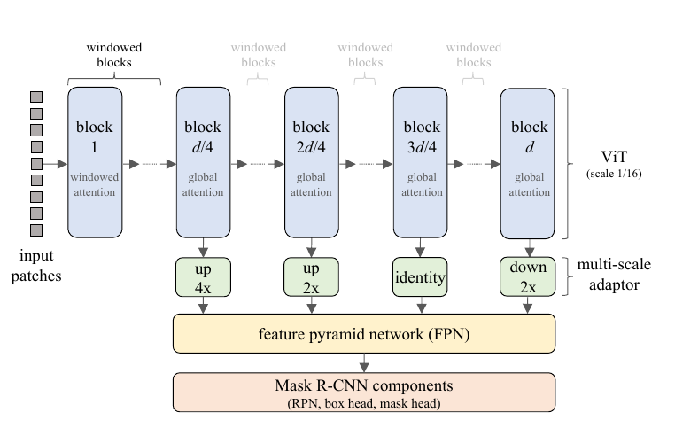
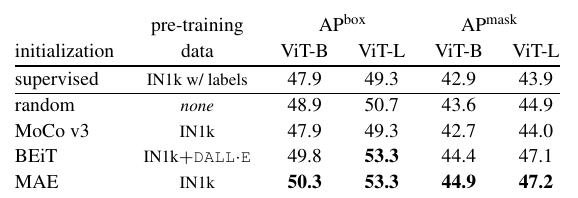
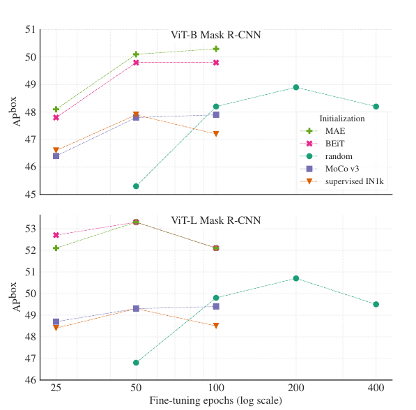
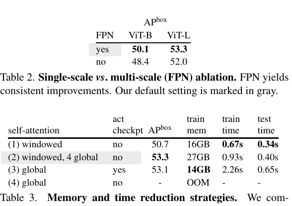
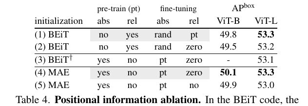
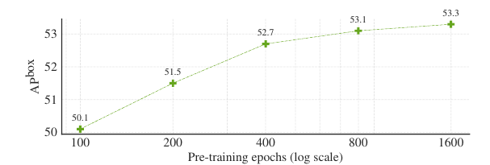
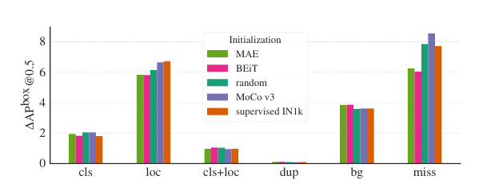
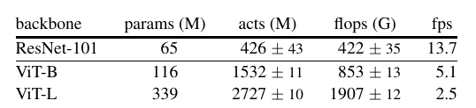

# 
Benchmarking Detection Transfer Learning with Vision Transformers
 

[论文](https://arxiv.org/pdf/2111.11429.pdf)

## introduction

为测试预训练模型能否带来性能增益（准确率提升或者训练速度提升），目标检测是一个常用的且非常重要的下游任务。目标检测的复杂性使得这种迁移的测试变得尤为重要。然而架构不一致、缓慢训练、高内存占用以及未知训练机制等困难阻碍了标准 vit 在目标检测任务上的迁移学习。

无监督或者自监督的深度学习方法常被用来初始化预训练模型（使用到下游任务之前）的参数。然后通过在下游任务的指标（准确性，收敛速度）和 baseline（有监督的预训练、或随机初始化从头训练）的比较进行判断预训练模型的好坏。

比如 CNN 比较泛用，所以基于 CNN 的无监督方法迁移到下游任务就比较容易。

基于 vit 的无监督模型潜力很大；

本文提出了训练技术以克服上述挑战，并采用标准 vit 作为 Mask R-CNN 的 bacbone，在目标检测或实例分割上探索 vit，使用 COCO 和 Mask R-CNN。

## method

**FPN Compatibility**

文中提出将 vit 与 fpn 进行结合，遇到的问题有：
1.如何与fpn适配；
2.如何解决内存需求大和推理费时的问题。

mask rcnn 可以与输出为单尺度或者多尺度的 backbone 结合（多尺度的特征可以送到 fpn），这里使用了 fpn。

而 vit 仅输入单尺度特征，而非多尺度的，文中采用了 XCiT 中的方法对 vit 中间特征进行上采样下采样，以提供不同尺度特征。

Swin 与 MViT 通过修改 VIT 架构解决了 ViT 无法输出多尺度特征的问题。

**Reducing Memory and Time Complexity**

文中提出采用 Windowed Self-attention，即局部自注意力；文中提出将图像块拆分为非重叠窗口并在每个窗口独立计算自注意力。这种处理方式可以大幅降低空间复杂度与时间复杂度。但这样不能跨窗口聚合信息，所以文中方法每隔一个 Windowed block 使用一个 global attention block。

**Upgraded Modules**

mask rcnn 的改动：
1.fpn 卷积后接 bn
2.rpn 采用两个卷积
3.roi 分类和 box 回归采用四个卷积后接一个全连接层，而非原始的两层 mlp
4.mask head 中的卷积后接 bn

**Training Formula**

他们训练中使用的策略如下：
1.LSJ 数据增广
2.AdamW + Consine 学习率调整 + linear warmup
3.DropPath 正则技术
4.batch = 64

使用预训练初始化时，fine-tune 100 epoch，从头训练时，训练 400 epoch；

**Hyperparameter Tuning Protocol**
对 lr、weight decay、drop path rate 进行微调
1.固定 dp = 0，对 lr、weight decay 采用 grid research
2.对于 vit-b，从 0、0.1、0.2、0.3 中选择，其中 dp = 0.1 最优
3.对于 vit-l，选择 vit-b 的 lr 和 wd，发现 dp = 0.3 最好

**Initialization Methods**

backbone 初始化：
1.随机初始化
2.监督学习，比如在 ImageNet 上训练
3.MoCo v3，使用在 ImageNet 上无监督训练的 vit-b、vit-l 的权重
4.BEiT，使用官方的 BEiT 去训练 vit-b、vit-l
5.MAE，采用 MAE 训练 vit-b、vit-l。

## experiments

文章对五种预训练方法进行了对比；

文中提到，他们尽可能进行消融实验，但是仍然存在一些变量无法控制它们相同
1.不同预训练方法 epoch 不同
2.BEiT 采用可学习的相对位置偏差，而非其他方法中的绝对位置；
3.BEiT 预训练使用了 layer scale，而其他方法没用；
4.尝试进行数据标准化，但是 BEiT 额外使用了 dVAE；

文中测试了不同预训练 epoch 的结果;

## summary

文中非常详细的给出了将自监督预训练模型应用到目标检测任务上的指导细节，以实现 vit 和 mask rcnn 结合；花费的内存和时间都是可以接受的，并且在 COCO 上实现了很好的结果。