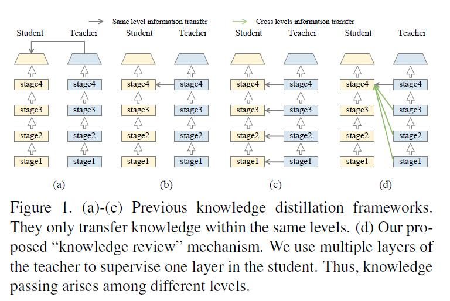
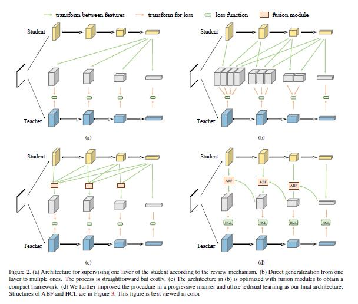
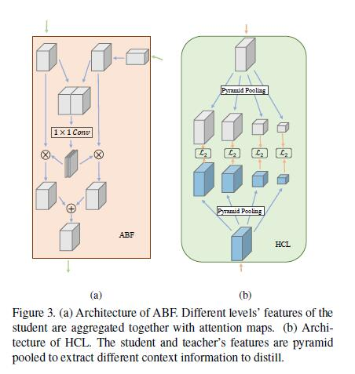
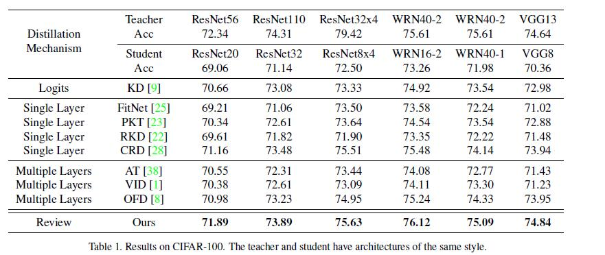
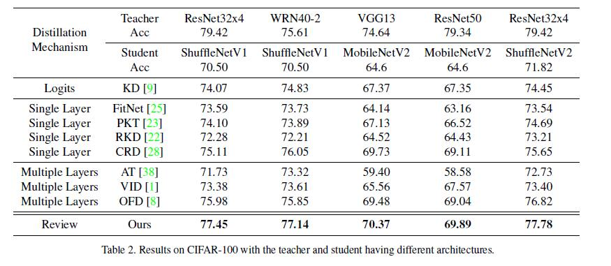
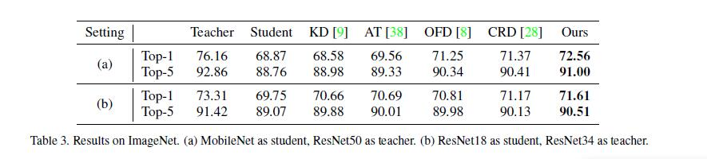
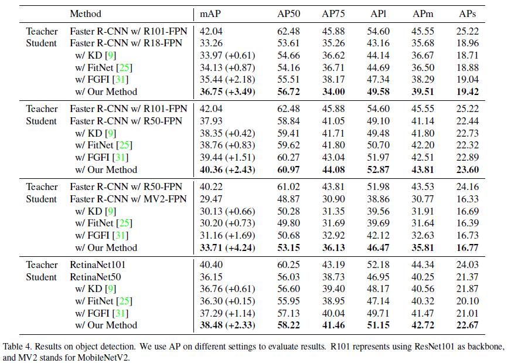
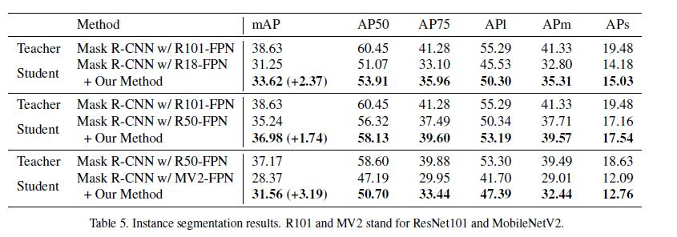
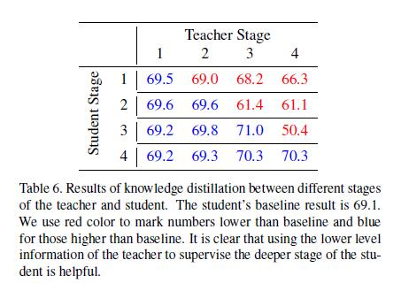
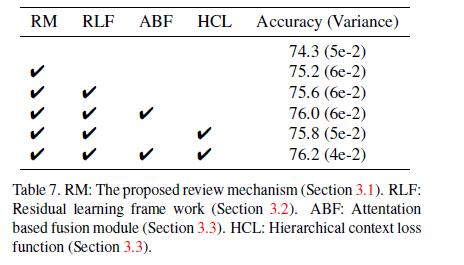

# 
Distilling Knowledge via Knowledge Review

#### 
By David Wang

## 1. 论文简述
&emsp;&emsp;本篇论文选自 CVPR 2021，引用格式(APA)为：  
Chen, P., Liu, S., Zhao, H., & Jia, J. (2021). Distilling Knowledge via Knowledge Review. In Proceedings of the IEEE/CVF Conference on Computer Vision and Pattern Recognition (pp. 5008-5017).  
&emsp;&emsp;深度卷积神经网络（CNN）已经在各种计算机视觉任务中取得了显著的成功。然而，CNN的成功往往伴随着相当大的计算量和内存消耗，这使得它在资源有限的设备上的应用成为一个具有挑战性的课题。已经有一些技术用于训练快速和紧凑的神经网络，包括设计新的架构，网络修剪，量化，以及知识蒸馏。  
&emsp;&emsp;知识蒸馏是将知识从教师网络转移到学生网络，目的是为了极大地提高学生网络的性能。以前的方法大多集中在提出同一层次的特征之间的特征转换和损失函数来提高有效性。本篇论文不同程度地研究了教师和学生网络之间的连接路径跨级的因素，并揭示了其巨大的重要性。在知识提炼中，首次提出了跨级连接路径，新的审查机制是有效的，结构上也很简单。本文最终设计的嵌套和紧凑的框架所需的计算开销可以忽略不计，并且在各种任务上优于其他方法。将该方法应用于分类、对象检测和实例分割任务。所有这些任务都见证了学生网络性能的显著提高。  
&emsp;&emsp;本文从一个关于教师和学生之间的连接路径的新角度来解决问题,首先展示了以前的工作是如何处理这些路径的。如图1(a)-(c)所示，所有以前的方法只使用同级别的信息来指导学生。例如，当监督学生的第四阶段输出时，总是利用教师的第四阶段信息。这个程序看起来很直观，很容易构建。但我们耐人寻味地发现，这其实是整个知识蒸馏框架的一个瓶颈--结构的快速更新令人惊讶地提高了许多任务的整个系统性能。  

  

&emsp;&emsp;本文研究了以前被忽视的在知识蒸馏中设计连接路径的重要性，并相应提出了一个新的有效框架。关键的修改是利用教师网络中的低级特征来监督学生的深层特征，从而使整体性能得到很大的提高。同时进一步分析网络结构，发现学生的高层次阶段有很大能力从教师的低层次特征中学习有用的信息。类似人类学习过程，本文使用了一个知识回顾框架，使用教师的多层次信息来指导学生网络的单层次学习。 如图1（d）所示，本文称之为 "知识回顾"。复习机制是使用以前的（较浅的）特征来指导当前的特征。 这意味着学生必须经常检查以前学习过的东西，以刷新对 "旧知识 "的理解和背景。本文提出了一个剩余学习框架，以使学习过程稳定和高效。此外，还设计了一个新的基于注意力的融合（ABF）模块和一个分层上下文损失（HCL）函数来提高性能。 通过实验验证，本文提出的框架使学生网络大大提高了学习的有效性。  
## 2. 论文相关知识点整理
&emsp;&emsp;知识蒸馏 (Distilling the knowledge, KD)是 Hinton等人 15年提出的用于模型压缩的方法，即将大规模模型（Teacher）压缩为具有相近表现的小模型（Student）上，提升推理速度，便于工业界使用。具体做法为使用模型输出的Logits作为监督信息，用于指导小模型的学习。而后Bengio等人提出利用模型中间层来传递知识，模型中间层包含更丰富的 high-level 以及 low-level 的信息，可以更好的将Teacher的信息传递到Student. 在2019年，Overhaul 模型的提出多个工程性的Trick 优化 Feature-based 的方法，并在多个任务上取得明显的提升，并且超过了 Teacher 模型。  
&emsp;&emsp;目前大部分关于KD的方法都是基于 **相同层** 或者 **相同Block** 之间的知识迁移，但这种相同层蒸馏方式在训练过程中是不合理的。Teacher 深层表示抽象的语义信息，底层表示简单的知识的信息，在 Student 训练初期，直接学习Teacher的深层抽象语义信息，显然是非常困难。由此作者提出让Student训练中既能看到抽象的知识又能看到简单的知识，这样开始的时候可以先学习简单的知识，训练后期可以重点学习抽象的知识。（论文对于目前一些跨层的KD的工作并没有充分的引用以及解释说明其差异性）  
&emsp;&emsp;学生网络从groundtruth标签和教师提供的软标签中学习。Fit- Net通过一个阶段的中间特征来提炼知识。FitNet的想法很简单，学生网络的特征通过卷积层被转移到教师的相同形状。$\mathcal{L}_2$距离被用来测量它们之间的距离。  
&emsp;&emsp;许多方法都效仿FitNet，使用单阶段特征来提炼知识。PKT将教师的知识建模为一个概率分布，并使用KL发散来测量距离。RKD使用多个实例关系来指导学生的学习。CRD将对比性学习和知识提炼结合起来，并使用对比性目标来转移知识。  
&emsp;&emsp;还有一些方法使用多阶段信息来转移知识。AT使用多层注意力图来转移知识。FSP从层特征中生成FSP矩阵，并使用该矩阵来指导学生。 SP进一步改进了AT。SP不使用单一的输入信息，而是使用实例之间的相似性来引导学生。OFD包含一个新的距离函数，使用边际ReLU提炼出教师和学生之间的主要信息。  
## 3. 本文方法介绍
&emsp;&emsp;本文首先正式确定了知识蒸馏过程和审查机制。然后，提出了一个新的框架，并引入了基于注意力的融合模块和层次化的上下文损失函数。  
### 3.1 回顾机制
&emsp;&emsp;给定一个输入图像$\mathbf{X}$和学生网络$\mathcal{S}$，我们让$\mathbf{Y}_\mathcal{S} = \mathcal{S}(\mathbf{X})$代表学生的输出对数。$\mathcal{S}$可以分成不同的部分$(\mathcal{S}_1, \mathcal{S}_2, ..., \mathcal{S}_n, \mathcal{S}_\mathcal{c})$，其中$\mathcal{S}_\mathcal{c}$是分类器，$\mathcal{S}_1, ..., \mathcal{S}_n$是由下采样层分隔的不同阶段。因此，生成输出$\mathbf{Y}_\mathcal{S}$的过程可以表示为：  
$\mathbf{Y}_\mathcal{S}=\mathcal{S}_\mathcal{c}\circ \mathcal{S}_n \circ ... \circ \mathcal{S}_1(\mathbf{X})$  
本文把"$\circ$"称为函数的嵌套，其中$g\circ f(x) = g(f(x))$。$\mathbf{Y}_\mathcal{S}$是学生的输出，中间的特征是$(\mathbf{F}_\mathcal{s}^1, ..., \mathbf{F}_\mathcal{s}^n)$。第$i$个特征的计算方法为：  
$\mathbf{F}_\mathcal{s}^i=\mathcal{S}_i \circ ... \circ \mathcal{S}_1(\mathbf{X})$  
对于教师网络$\mathcal{T}$，其过程几乎相同，省略细节。按照以前的记号,单层知识蒸馏可以表示为：  
$\mathcal{L}_{SKD}=\mathcal{D}(\mathcal{M}_\mathcal{s}^i(\mathbf{F}_\mathcal{s}^i),\mathcal{M}_\mathcal{t}^i(\mathbf{F}_\mathcal{t}^i)) $  
其中$\mathcal{M}$是将特征转移到注意图或因素的目标表示的变换。$\mathcal{D}$是衡量学生老师之间差距的距离函数。同样地，多层知识蒸馏写为：  
$\mathcal{L}_{MKD}=\sum_{i\in \mathbf{I}}\mathcal{D}(\mathcal{M}_\mathcal{s}^i(\mathbf{F}_\mathcal{s}^i),\mathcal{M}_\mathcal{t}^i(\mathbf{F}_\mathcal{t}^i)) $  
其中，$\mathbf{I}$存储的特征层用于转移知识。  
&emsp;&emsp;本文的审查机制是用以前的特征来指导当前的特征。带有审查机制的单层知识蒸馏被形式化为：  
$\mathcal{L}_{SKD\_R}=\sum_{j=1}^i \mathcal{D}(\mathcal{M}_\mathcal{s}^{i,j}(\mathbf{F}_\mathcal{s}^i),\mathcal{M}_\mathcal{t}^{j,i}(\mathbf{F}_\mathcal{t}^j)) $  
虽然乍一看，它与多层知识蒸馏法有一些相似之处，但实际上它有本质的区别。在这里，学生的特征被固定为$\mathbf{F}_\mathcal{s}^i$，而本文使用教师的前$i$层特征来指导$\mathbf{F}_\mathcal{s}^i$。复习机制和多层蒸馏法是互补的概念。当复习机制与多层知识蒸馏相结合时，损失函数变为：  
$\mathcal{L}_{MKD\_R}=\sum_{i\in \mathbf{I}} (\sum_{j=1}^i \mathcal{D}(\mathcal{M}_\mathcal{s}^{i,j}(\mathbf{F}_\mathcal{s}^i),\mathcal{M}_\mathcal{t}^{j,i}(\mathbf{F}_\mathcal{t}^j))) $
在本文的实验中，$\mathcal{L}_{MKD\_R}$损失只是在训练过程中与原始损失一起单独加入，推理结果与原始模型完全相同。所以本文的方法在测试时是完全没有成本的。使用因子来平衡蒸馏损失和原始损失。以分类任务为例，整个损失函数被定义为：  
$\mathcal{L}=\mathcal{L}_{CE}+\mathcal{L}_{MKD\_R} $  
在本文提出的审查机制中，只使用教师的较浅的特征来监督学生的较深的特征。相反的做法带来的好处不多，反而浪费了很多资源。直观的解释是，更深更抽象的特征对于早期阶段的学习来说过于复杂。  
### 3.2 剩余学习框架
&emsp;&emsp;本文首先设计了一个简单的框架，如图2（a）所示。变换$\mathcal{M}_\mathcal{s}^{i,j}$只是由卷积层和最近插值层组成，将学生的第i个特征转移到与教师的第j个特征的大小一致。我们不对教师的特征$\mathbf{F}_t$进行转换。 学生的特征被转换为与教师特征相同的大小。  

  

&emsp;&emsp;图2(b)显示了直接将该想法应用于多层蒸馏，并对所有阶段的特征进行蒸馏。然而，由于各阶段之间存在巨大的信息差异，这种策略并不是最优的。而且，它产生了一个复杂的过程，所有的特征都被使用。例如，一个有n个阶段的网络需要计算n(n+1)/2对关于损失函数的特征，这使得学习过程变得繁琐，并花费很多资源。  
&emsp;&emsp;为了使该程序更加可行和优雅，可重写公式：  
$\mathcal{L}_{MKD\_R}=\sum_{i=1}^n (\sum_{j=1}^i \mathcal{D}(\mathbf{F}_s^i,\mathbf{F}_t^j)) $  
其中为简单起见，省略了特征的变换。现在我们将i和j的两个和的顺序调换为:  
$\mathcal{L}_{MKD\_R}=\sum_{j=1}^n (\sum_{i=j}^n \mathcal{D}(\mathbf{F}_s^i,\mathbf{F}_t^j)) $  
当j是固定的，上式累积了教师特征$\mathbf{F}_t^j$和学生特征$\mathbf{F}_s^j-\mathbf{F}_s^n$之间的距离。通过特征的融合，本文将距离的总和近似为融合特征的距离。这就导致了  
$\sum_{i=j}^n \mathcal{D}(\mathbf{F}_s^i,\mathbf{F}_t^j)\approx\mathcal{D}(\mathcal{u}(\mathbf{F}_s^j, ..., \mathbf{F}_s^n), \mathbf{F}_t^j) $  
其中$u$是一个融合特征的模块。图2(c)说明了这种近似的结构现在更加有效。但融合的计算可以进一步逐步优化，如图2（d）所示，以获得更高的效率。$\mathbf{F}_s^j, ..., \mathbf{F}_s^n$的融合是由$\mathbf{F}_s^j$和$u(\mathbf{F}_s^{j+1}, ..., \mathbf{F}_s^n))$组合计算的，其中融合操作递归定义为$u(.,.)$，应用于连续的特征图。将$\mathbf{F}_s^{j+1,n}$表示为$\mathbf{F}_s^{j+1}$到$\mathbf{F}_s^n$的特征融合，损失写为：  
$\mathcal{L}_{MKD\_R}=\mathcal{D}(\mathbf{F}_s^n,\mathbf{F}_t^n)+\sum_{j=n-1}^1\mathcal{D}(u(\mathbf{F}_s^{j}, \mathbf{F}_s^{j+1,n}),\mathbf{F}_t^j) $  
这里从n-1向下循环到1，利用$\mathbf{F}_s^{j+1,n} \cdot \mathbf{F}_s^{n,n}=\mathcal{M}_s^{n,n}(\mathbf{F}_s^n) $。详细结构如图2(d)所示，其中ABF和HCL分别是为这个结构设计的融合模块和损失函数。  
&emsp;&emsp;图2(d)中的结构是优雅的，它利用剩余学习的概念简化了蒸馏过程。 例如，阶段4的学生特征与阶段3的学生特征聚集在一起，模仿阶段3的教师特征。因此，阶段4的学生特征学习了阶段3的学生和老师之间的特征的残余。残留信息很可能是教师产生更高质量结果的关键因素。  
&emsp;&emsp;这种剩余的学习过程比直接让学生从教师的低层次特征中学习的高级特征更稳定和有效。通过残差学习框架，学生的高级特征可以更好地逐步提取有用的信息。  
### 3.3 ABF 和 HCL
&emsp;&emsp;图2(d)中有两个关键部分。它们是基于注意力的融合（ABF）和层次化的上下文损失（HCL）。  

  

&emsp;&emsp;图3(a)。高层次的特征首先被调整为与低层次特征相同的形状。然后，来自不同层次的两个特征被串联在一起，生成两个H×W 注意力图。这些图分别与两个特征相乘。最后，这两个特征相加产生最终输出。  
&emsp;&emsp;ABF模块可以根据输入特征生成不同的注意图。因此，两个特征图可以动态地进行汇总。自适应汇总比直接汇总更好，因为两个特征图来自网络的不同阶段，它们的信息是多样的。低级和高级特征可能集中在不同的分区。 注意力图可以更合理地聚合它们。  
&emsp;&emsp;HCL的细节如图3(b)所示。通常情况下，使用$\mathcal{L}_2$距离作为两个特征图之间的损失函数。$\mathcal{L}_2$距离可以有效地在同一层次的特征之间传递信息。但在本文的框架中，不同层次的信息被聚合在一起，以向老师学习。琐碎的全局$\mathcal{L}_2$距离不足以转移复合层次的信息。  
&emsp;&emsp;本文提出了HCL，利用空间金字塔集合，将知识的转移分离成不同层次的背景信息。通过这种方式，信息在不同的抽象层次中被更好地蒸馏出来。其结构非常简单：首先利用空间金字塔集合法从特征中提取不同层次的知识，然后利用$\mathcal{L}_2$距离在它们之间分别进行蒸馏。   
## 4. 实验与结果分析 
&emsp;&emsp;本文作者对各种任务进行了实验。首先，将提出的方法与其他关于分类的知识提炼方法进行比较。对不同的设置、不同的结构和数据集进行了实验。同时，将方法应用于对象检测和实例分割任务，也以较大的幅度持续改进基线模型。  
### 4.1 分类

  

&emsp;&emsp;上表展示了CIFAR-100上的结果，本文方法采用了多层特征与审查机制。它在所有的架构上都优于之前的所有方法。 

  

&emsp;&emsp;上表说明知识审查机制成功地放松了以前强调的中间层或最后一层的蒸馏条件。  

  

&emsp;&emsp;在ImageNet上进行了实验，以验证方法的可扩展性，结果如上表所示。本文的方法再次优于所有其他方法。设置(a)由于结构的不同而具有挑战性。 但是优势始终是突出的。在设置（b）中，学生和老师之间的差距已经被以前的最佳方法减少到一个非常小的数值2.14。本文的方法进一步将其减少到1.70，实现了20%的相对性能改进。  
### 4.2 目标检测

  

&emsp;&emsp;;由于只有少数方法被声称可用于检测，本文转载了流行的方法和最新的方法。如上表所示，知识提炼方法，如KD和FitNet，也提高了检测的性能，但是收益是有限的。FGFI是直接为检测而设计的，在这个任务上比其他方法效果更好。不过，本文的方法还是以很大的优势超过了它。  
### 4.3 实例分割

  

&emsp;&emsp;本文创新性得首次将知识蒸馏用于实例分割，同样达到了SOTA效果，如上表所示。
## 4.4 更多分析
&emsp;&emsp;**跨阶段的知识蒸馏** 本文分析了跨阶段知识转移的有效性：

  

&emsp;&emsp;从教师那里提炼出学生的同阶段信息是最好的解决方案。 这与我们的直觉是一致的。此外，耐人寻味的是，来自较低层次的信息也是有帮助的。但是，从教师的高层提炼对学生的训练有不利的影响。  
&emsp;&emsp;这表明，较深阶段的学生有能力从较低阶段的教师那里学到有用的信息。反之，对于早期阶段的学生来说，来自教师的更深层次和更抽象的特征过于复杂。这与我们的理解和我们提出的审查机制是一致的，即利用教师的浅层阶段来监督学生的深层阶段。  
&emsp;&emsp;**消融实验** 在实验中逐一加入消融成分以测量其效果，如下表所示：  

  

&emsp;&emsp;通过本文提出的复习机制，结果比基线有所提高，如第二行所示，它使用了图2(b)中所示的三段式结构。当我们用残差学习框架进一步细化结构时，学生产生了更大的收益。基于注意力的融合模块和层次化的上下文损失函数在单独利用时也提供了很大的改进。而当我们把它们集合在一起时，就会得到最好的结果。 令人惊讶的是，它们甚至比老师还要好。  
## 5. 总结与感悟
&emsp;&emsp;本文从一个新的角度研究了知识蒸馏，并相应地提出了审查机制，即用教师中的多层来监督学生中的一层。与之前所有的SOTA相比，该方法在所有的分类、物体检测和实例分割任务上都取得了一致的显著改善。  
本文的主要贡献为：  
- 我们在知识蒸馏中提出了一种新的审查机制，利用教师的多层次信息来指导学生网的单层次学习。  
- 我们提出了一个剩余学习框架，以更好地实现审查机制的学习过程。  
- 为了进一步改进知识审查机制，我们提出了一个基于注意力的融合（ABF）模块和一个层次化的上下文损失（HCL）函数。  
- 通过应用我们的蒸馏框架，我们在多个计算机视觉任务中实现了许多紧凑模型的最先进性能。  
&emsp;&emsp;个人认为本文的不足在于：金字塔池化可能会有问题，student和teacher变成多级可能会更好？