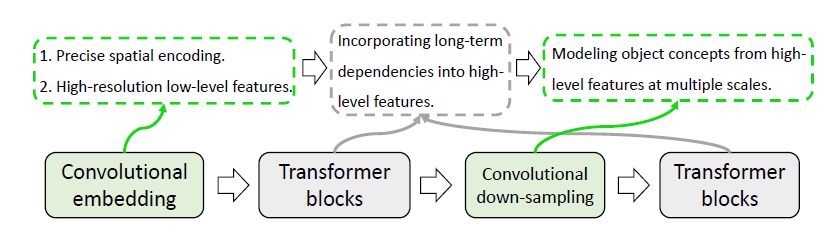

# 
nnFormer Interleaved Transformer for Volumetric Segmentation

## 
12/21 By Jiakun, Wang

## 1.相关背景
&emsp;&emsp;《nnFormer: 交错式Transformer用于密集体分割》出自MICCAI 2021。[论文链接](https://arxiv.org/abs/2109.03201)
&emsp;&emsp;Transformer是自然语言处理中的默认选择模型，可以利用自注意力机制捕捉长距离依赖关系，最近在CV领域被广泛利用。与卷积神经网络相比，Transformer将降低定位的归纳偏见（inductive bias）,使其更有能力处理非局部的相互作用关系。

## 1.写作目的
&emsp;&emsp;有许多方法试图将Transformer用于医学图像分割领域，如TransUNet,将卷积网络用于特征提取，Transformer用于帮助编码全局背景信息。作者认为TransUNet并未将Transformer的优势充分利用，一到两层的Transformer不足以将长距离依赖与卷积表征联系在一起，卷积表征通常意味着精确的空间信息并提供分层的概念。
&emsp;&emsp;Swin-UNet和DS-TransUNet将Transformer作为分割模型的主干网络，但却并没有探索将如何适当的结合卷积和自我注意力机制来建立一个最佳的医学分割网络。为了解决这个问题，作者将卷积和自我注意力交错使用，充分发挥他们各自的优势。

## 3.解决方案
&emsp;&emsp;nnFormer的主要贡献是他的混合主干，其中卷积和自我注意力机制被交错使用，首先把一个轻量级的卷积嵌入层放在Transformer块的前面。与直接将原始像素和应用一维预处理相比，卷积嵌入层对精准（即像素级）空间信息进行编码，提供低水平但高分辨率的三维特征。在嵌入块之后，Transformer和卷积块交织在一起，以充分混合不同尺度的高层次和分层长距离依赖关系，有助于提高所习得表征的泛化能力和鲁棒性。

## 4.核心思想及创新点
### 4.1网络结构
&emsp;&emsp;nnFormer保持了与UNet类似的U型结构，主要由两个分支组成，即编码器和解码器。具体来说，编码器包括一个嵌入块，七个Transformer块和三个下采样快。对称地，解码器分支包括七个Transformer块，3个上采样块和一个用于进行最终预测的扩展块。受UNet启发，作者以对称的方式在编码器和解码器的相应特征金字塔之间增加了长的残差连接，这将有助于恢复预测中的细粒度细节。

### 4.2编码器
#### 4.2.1Embedding层
&emsp;&emsp;Embedding层负责将每个输入$\chi$转化为高维度张量$\chi_e \in R^{\frac{H}{4} \times \frac{W}{4} \times \frac{D}{2} \times C}$,$\frac{H}{4} \times \frac{W}{4} \times \frac{D}{2}$代表patch大小，C代表序列长度。在初始阶段使用小的卷积核的连续卷积层会带来更多的好处，这可以从两个角度来解释，即为什么使用连续的卷积层和为什么使用小的卷积核。对于为什么使用连续的卷积层，因为他们对像素级的空间信息进行编码比Transformer中使用的patch位置编码更加精准，对于为什么使用小的卷积核，与大的卷积核相比，小的卷积核尺寸有助于降低计算的复杂性，同时提供同等大小的感受野。Embedding层由四个卷积层组成，卷积核大小为3。在每个卷积层（除了最后一个）之后，附加一个GELU 和一个LayerNorm层。在实践中，根据输入Patch的大小，Embedding层中卷积的步长可能会发生相应的变化。

#### 4.2.2Transformer块
&emsp;&emsp;将下采样卷积和初始Embedding层编码的高分辨率空间信息提供给交错的Transformer块，采用分层的方式进行self-attention，在三维局部体积内进行计算self-attention（V-MSA,基于提及的多头自我注意力机制），而不是二维局部窗口。
&emsp;&emsp;假设$\chi_t \in \mathcal{R}^{L \times C}$是Transformer块的输入，它将首先被重塑为$\hat{\chi_t} \in \mathcal{R}^{N_V \times {N_T} \times{C}}$,$N_V$代表三维局部体积块的数量，$N_T = S_H \times S_W \times S_D$表示每个体积块中patch数量。{$S_H, S_W, S_D$}代表局部体积块大小。为了适应各种形状的MRI/CT同时满足固定的{$S_H, S_W, S_D$}而强行填充数据是不可取的。因此，输入的$\chi$大小需要适应性的调整，以符合局部体积块的大小。在实践中，作者在Synapse和ACDC上将{$S_H, S_W, S_D$}分别设置为{4, 4, 4}和{5, 5, 3}。计算过程为：
$$\hat{\chi}_{t}^{l} = V-MSA(LayerNorm(\chi_t^{l-1}) + \chi_t^{l-1}) $$,
$$\chi_t^l = MLP(LayerNorm(\hat{\chi}_{t}^{l}) + \hat{\chi}_{t}^{l}) $$
$$\hat{\chi}_{l}^{t+1} = SV-MSA(LayerNorm(\chi_t^{l})) + \chi_t^{l} $$
$$\chi_t^{l+1} = MLP(LayerNorm(\hat{\chi}_{l}^{t+1})) + \hat{\chi}_{l}^{t+1} $$
&emsp;&emsp;在这里,l代表层的索引。V-MSA和SV-MSA表示基于体积的多头注意力机制和它的移位版本。每个三维体积内的$\mathcal{QKV}$注意力计算为
$$Attention(\mathcal{Q,K,V}) = softmax(\frac{\mathcal{Q}\mathcal{K^T}}{\sqrt{d_k}} + B)V$$

#### 4.2.3下采样块
&emsp;&emsp;通过将Swin中的相邻并列操作替换为直接串联卷积，nnTranformer对体积分割提供了更多的改进。背后的原因是卷积下采样产生了层次化的表示，有助于在多个尺度上对物体概念进行建模。

### 4.3解码器
&emsp;&emsp;解码器的Transformer块的结构与编码器的结构高度对称，与下采样块相反，我们采用分层去卷积，降低分辨率的特征图上采样为高分辨率的特征图，然后通过长距离的残差连接与来自编码器的表示合并，以捕捉语义和细粒度信息。与上采样块类似，最后一个扩展块采取卷积操作产生最终预测。

## 5.实验结果
### 5.1数据集选择
&emsp;&emsp;为了公平地比较nnFormer和以前基于Transformer的架构，作者在Synapse和Automatic Cardiac Diagnosis Challenge（ACDC）数据集上进行了实验。对于每个实验，重复三次并报告其平均结果。
- **Synapse for multi-organ CT segmentation.** 这个数据集包括30个腹部CT扫描的案例。提取18个案例建立训练集，其余12个案例用于测试。报告了用平均Dice相似度系数（DSC）对8个腹部器官（主动脉、胆囊、脾脏、左肾、右肾、肝脏、胰腺和胃）评估的模型性能。
- **ACDC for automated cardiac diagnosis.** ACDC涉及100个病人，右心室的腔体、左心室的心肌和左心室的腔体要进行分割。每个病例的标签涉及左心室（LV）、右心室（RV）和心肌（MYO）。数据集被分成70个训练样本，10个验证样本和20个测试样本。

### 5.2 Synapse实验结果
&emsp;&emsp;作者在Synapse上进行了实验，并将nnFormer与各种基于Transformer和convnet的baseline进行了比较。主要的评估指标是dice得分。除了nnUNet之外，表现最好的基于convnet的方法是DualNorm-UNet，它的平均dice分数为80.37。相比之下，WAD报告了最好的基于Transformer的结果，其平均值为80.30，略低于DualNorm-UNet。nnFormer能够比WAD和DualNorm-UNet的平均成绩分别高出8个百分点和7个百分点，这是对Synapse相当了不起的改进。

### 5.3 ACDC实验结果
&emsp;&emsp;我们可以看出，最好的Transformer模型是LeViT-UNet-384s，它的平均dice比SwinUNet略高，但比基于convnet的Dual-Attn高很多。相比之下，nnFormer平均超过LeViT-UNet-384s近1.5个百分点，再次显示了它对基于Transformer的baseline的优势。

## 6.总结及启发
### 6.1结论
&emsp;&emsp;在本文中，作者提出了一种名为nnFormer的新的医学图像分割网络。nnFormer是在卷积和自我注意力机制的交错结构上构建的，卷积结构有助于将精准的空间信息编码为高分辨率的低层次特征，并在多个尺度上建立层次化的概念。另一方面，Transformer中的自我注意力机制将长距离依赖与卷积表征纠缠在一起，以捕捉全局背景。在这种混合架构中，nnFormer比以前基于Transformer的分割方法取得了巨大的进步。
### 6.2启发
&emsp;&emsp;其实往小里说，nnFormer不过是基于Swin Transformer和nnUNet的经验结合，technical上的novelty并不多。但是往大里说的话，nnFormer其实是一个很好的起点，可以启发更多的人投入到相关的topic中开发出更好的基于Transformer的医疗影像分析模型。也许大幅度超越nnUNet的那一天并不遥远。