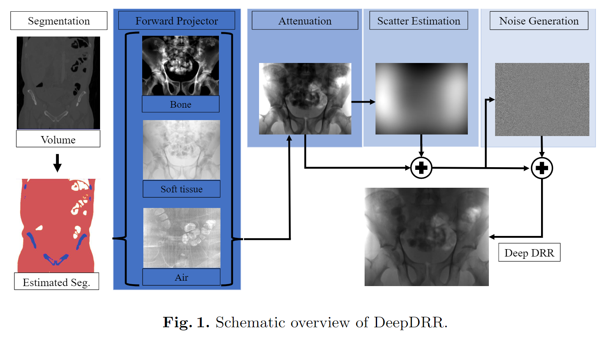
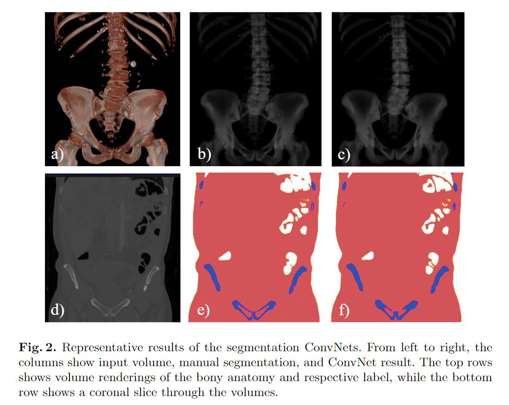

# 
DeepDRR -- A Catalyst for Machine Learning in Fluoroscopy-guided Procedures
 

By Mars Zhang

## 论文获取
&emsp;&emsp;《DeepDRR – 透视引导程序中机器学习的催化剂》，from Medical Image Computing and Computer Assisted Intervention – MICCAI 2018，引用格式为：

Unberath M. et al. (2018) DeepDRR – A Catalyst for Machine Learning in Fluoroscopy-Guided Procedures. In: Frangi A., Schnabel J., Davatzikos C., Alberola-López C., Fichtinger G. (eds) Medical Image Computing and Computer Assisted Intervention – MICCAI 2018. MICCAI 2018. Lecture Notes in Computer Science, vol 11073. Springer, Cham. https://doi.org/10.1007/978-3-030-00937-3_12

[论文下载链接](https://arxiv.org/pdf/1803.08606)

## 论文背景
&emsp;&emsp;在与诊断放射学相关的大多数学科中，基于机器学习方法优于竞争方法。但目前介入放射学尚未从深度学习中受益，主要有两个原因：第一手术过程中获得的大多数图像从未保存；其次即使保存了图像，由于大量的数据，相关的注释是个挑战。在考虑透视引导程序中，真正介入透视检查的替代方案是通过3D诊断CT对手术进行计算机模拟。这样标记相对容易获得，但是生成的合成数据正确性取决于前向模型，据此本文提出DeepDRR，这是一个用于从CT扫描中快速、真实地模拟透视和数字放射成像的框架，与深度学习的原生软件平台紧密结合。本文分别使用机器学习在 3D 和 2D 中进行Material Decomposition和散点估计，并结合解析前向投影和噪声注入来实现所需的性能。在骨盆 X 射线图像中的解剖标志检测示例中，本文证明了在DeepDRR上训练的机器学习模型可以推广到临床采集数据，而无需重新训练或领域适应。  
**Keywords：** 蒙特卡洛模拟，体分割，射线硬化，图像引导程序

## 知识梳理  
**DeepDRR：** 本文提出的基于Python、PyCUDA和PyTorch的框架，用于快速自动模拟CT数据中的X射线图像，由4个模块组成：1）使用深度分割ConvNet对CT体积进行Material Decomposition；2）一物质和光谱感知的光线追踪正向投影仪；3）基于神经网络的Rayleigh scatter estimation；4）噪声注入。各个步骤如下：

 

**Material Decomposition：** 本文使用从 *V-net: Fully convolutional neural networks
for volumetric medical image segmentation.* 改编的深度体积ConvNet来自动分解CT容积中的空气、软组织和骨。ConvNet是编码器-解码器结构，具有skip-ahead连接，以保留高空间分辨率的信息，同时实现大的感受野。ConvNet在具有128×128×128个体素的patch上进行训练，体素大小为0.86×0.86×1.0毫米，产生一个物质图$M（x）$，为每个三维点x分配一个候选物质。12个全身CT数据被手动注释，然后被分割：10个用于训练，2个用于验证和测试。训练在600个历时中进行，直到收敛，在每个历时中，从每个体积中随机提取一个补丁。在应用过程中，128×128×128个体素的patch以64的步长进行前馈，因为只接受中央64×64×64体素的标签。  
**Analytic Primary Computation：**分割的部分$M=\{air,soft,tissue,bone\}$可用，每种物质对探测器位置 u 处总衰减密度的贡献是使用给定的几何形状（由投影矩阵$p\in \mathbb{B}^{3\times 4}$定义）和 X 射线光谱密度 $p_0(E)$ 通过射线追踪计算得出的:$$p(u)=\int p(E,u)dE=\int p_0(E)exp(\sum_{m\in M}\delta(m,M(x))(\frac{\mu}{\rho})_m(E)\int\rho(x)dl_u)dE$$  
**Learning-based Scatter Estimation：** 最近通过 ConvNets 进行散点估计的方法优于基于内核的方法，同时保持较低的计算需求并且它们本质上与深度学习软件环境集成。本文定义了一个10层的ConvNet，前6层生成Rayleigh scatter estimates，后四层具有31 × 31内核和单通道，确保平滑度。该网络在通过蒙特卡洛模拟生成的 330 张图像上进行了训练，并通过随机旋转和反射进行了增强。最后三层是使用前几层的预训练来训练的。网络的输入被下采样到 128 × 128 像素。    
**Noise Injection：** 增加散点后，$p(u)$表示光子在探测器像素$u$中沉积的能量，光子数估计为：$$N(u)=\sum_E \frac{p(E,u)}{E}N_0$$
获得光子的数量$N(u)$并执行噪声注入。$N_0$是每个像素发射的光子数。X 射线图像中的噪声是由光子统计导致的不相关量子噪声（由于像素串扰而变得相关）和相关读出噪声的组合。

## 实验与结果
**框架验证**
对于 CT 体积中的空气、软组织和骨骼的体积分割，我们发现误分类率为 (2.03 ±3.63) %，这与使用该架构的先前研究报告的结果一致。测试集的代表性结果下图所示。对于散点估计，对由30个图像组成的测试集的评估产生的均方误差为总散射图像能量的6.4%。

 

无论使用的光子数量多少，一张 615 × 479 像素的 X 射线投影图像的模拟耗时 2.0 秒。  

**基于任务的评估**  
从根本上说，DeepDRR 的目标是能够在合成生成的数据上学习模型，这些数据可以推广到看不见的临床透视，而无需重新训练或其他领域适应策略。为此，我们考虑在任意视图的骨盆 X 射线图像中进行解剖标志检测。作者注释了骨盆 CT 体积中的 23 个解剖标志（下图，最后一列），并在 RAO/LAO 和 CRAN/CAUD 中分别在覆盖 120° 和 90° 的球段上生成了带有注释的 DRR。然后，学习一个顺序预测框架，并在收敛后用于预测尸体研究中看不见的真实 X 射线图像中的 23 个解剖标志。该网络被学习了两次：首先，在假设单一材料和单能谱的常规生成的 DRR 上，其次，在 Deep-DRR 上，如第 2 节所述。 2.2.图像有 615 × 479 像素，像素大小为 0.6162 mm。我们使用了钨阳极的光谱，工作电压为 120 kV，铝厚度为 4.3 mm，并假设每像素 5·105 个光子的高剂量采集。在下图中，我们展示了在遗体研究期间使用平板 C 臂系统（Siemens Cios Fusion，Siemens Healthcare GmbH，Germany）获取的看不见的临床数据的顺序预测框架的代表性检测。正如预期的那样，在传统 DRR（上排）上训练的模型无法预测临床数据上的解剖标志位置，而在 DeepDRR 上训练的模型即使在部分解剖结构上也能产生准确的预测。此外，我们想参考 *X-ray-transform invariant anatomical landmark detection for pelvic
trauma surgery. In: arXiv preprint.* 中报告的综合结果，这些结果是通过对提议的 DeepDRR 进行训练而获得的。