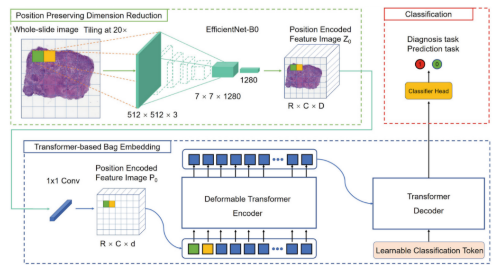
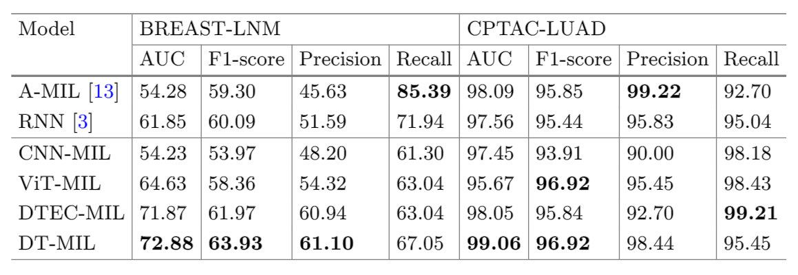

# 
DT-MIL: Deformable Transformer for Multi-instance Learning on Histopathological Image

胡惠杰

## 1、论文概述
&emsp;&emsp;近年来，由于成像技术的发展，通常病理图像的尺寸巨大，可以将其视为很多的实例的拼接。但是在进行图像的分析的时候，由于要考虑到其中的各类微环境，需将图像综合来分析，那么这就是一个Multi-instance Learning（MIL）任务。通常MIL有三种处理方式：包空间bag-space (BS), 实例空间instance-space (IS) and 嵌入空间embedded-space (ES)。前两者的实操性不强/效果不好，ES能够较为理想地进行全局影像分析。目前有多种ES的MIL方法，而由于Transformer在NLP领域所取得的巨大优势，其自注意力层允许它通过同时聚合序列中的所有元素来更新序列的每个元素，并且位置编码过程允许模型利用位置信息；并且计算效率和可扩展性的特性为其在计算机视觉应用中提供了潜在价值，所以本文创新地将transformer引入到医学影像的MIL中，提出了一种ES-MIL的模型：DT-MIL。

 

&emsp;&emsp;DT-MIL的框架如上图所示。它主要包含三个模块：保持位置的降维（PPDR）、基于transformer的包嵌入（TBBE）和分类器。在 PPDR 组件中，使用卷积神经网络 (CNN) 编码器将 全局图像whole slide images（WSI） 下采样为小特征图像，其中原始 WSI 中的每个补丁都嵌入为超像素（提取的实例级特征）位于相应的位置。然后是设计的包嵌入模块，它由一个用于自动实例级特征选择的 1×1 卷积层和一个用于生成高级包表示的可变形转换器encoder - decoder组成，该包表示综合参考所有实例特征并利用 2D位置信息。 Transformer 中的 self-attention 机制在包嵌入过程中为不同的实例特征分配可变权重，实现自适应实例选择。可变形变压器编码器中的可变形注意力模块可以进一步降低模型复杂度，并让包嵌入模块更多地关注关键信息实例。最后，在获得信息丰富的高级袋表示后，跟随分类头进行最终预测。

## 2、实验
&emsp;&emsp;实验在两个数据集中进行：BREAST-LNM（用于预测淋巴结转移的乳腺癌患者活检切片，包含3957张影像）、CPTAC-LUAD（用于预测淋巴结转移的乳腺癌患者活检切片，包含1056张影像）。DT-MIL 模型以端到端的方式使用 Adam 优化器进行训练，学习率为$2\times 10^{-4}$，权重衰减为 $1\times 10^{-4}$，batch size 为 2.

&emsp;&emsp;对比实验与最先进的方法（A-MIL 和 RNN）CNN-MIL、以及其他基于transformer的方法ViT-MIL 和DTEC-MIL作比较。结果验证了所提出的 DT-MIL 方法在肺癌诊断和乳腺癌转移预测方面的优越性。Transformer 的注意力机制可以从全局视图中区分信息块并将它们有效地嵌入到袋子表示中，因而能在预测任务上取得卓越的性能，因为在诊断任务中，模型只需要区分肿瘤组织和正常组织，然而在转移预测任务中，肿瘤进展更多地取决于微环境的变化，而不是局部形态特征。

 

## 3、知识整理

有待补充...

## 4、总结
&emsp;&emsp;本文提出的基于Transformer的DT-MIL的模型的优点有：
- 以全训练的方式生成包
- 以高水平和非线性的方式结合所有实例来重新呈现包
- 在包的嵌入阶段会嵌入位置关系和上下文信息

&emsp;&emsp;可见注意力机制用于大图像的分类和预测任务的巨大优越性。而对于不同领域中优秀模型的迁移，实际上要求精心去设计相关的流程与细节。我认为本文在这方面的工作比较有价值，同时设计出多种基于Transformer的ES-MIL方法，并采取其中表现最优的模型，创新点明显。