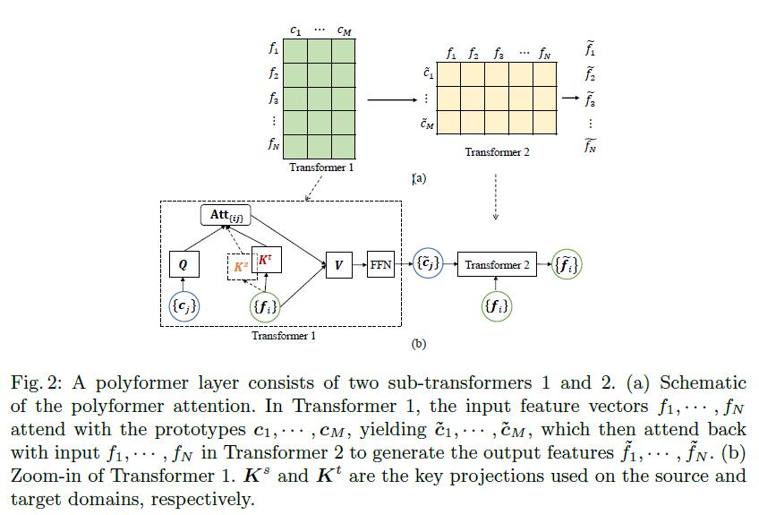

# Few-Shot Domain Adaptation with Polymorphic Transformers

## introduction

不同数据域之间往往是有差异的，一个模型在一个 domain 上表现很好，但可能迁移到另一个数据集上表现就很差。同时在医学临床上，又不容易一下得到足够的标注数据，于是就有了Few-Shot Domain Adaptation。

这篇文章提出了一个 Polyformer 可以作为 Few-Shot Domain Adaptation 的 backbone 或融合到使用的 backbone 中。

如果数据量足够大，那么 da 可能是没有必要的。有很多方法采用了一种缩小 domain adversarial loss 的方法，来缩小 domain 差异，这种方法可以运用到无监督和半监督学习中，本文具体消融实验也考虑了使用该方法，将该方法作为本文方法的补充。

一个常见的方法就是在 source、target domain 的共同集合上重新训练，但是如果 source domain 占主导，结果就不是最优的。另一种常用方法就是将模型在 target domain 上 fine tune，但是在 few shot 场景下不可取。一种方法是固定特征提取的部分，只预训练 task head。

本文提出的方法，将 polyformer 嵌入到训练好的模型中，担任 DA 的作用，首先提取出 source domain 的 prototype embedding（是一个 source domain feature 的压缩的表示），在 target domain 上，使用该压缩表示，动态的转换目标域的 feature。transformer 的投影部分使 transformed 后的目标域的 feature 与源域的 feature相兼容（adaptation 只更新投影部分）。

本方法通过在 vanilla U-Net 上证明 polyformer 的有效性，并在两个医学分割任务上进行了评估，眼底图像分割和息肉分割任务。

关于 few-shot learning：FSL 与 few-shot DA 是不一样的。前者使用一个预训练模型，然后在一个新的 task 上使用（新的分类目标），这个任务的训练的样本可能很少。对于后者，模型始终在一个任务上。在 FSL 中，首先得到输入训练数据的 prototype embedding，然后对于查询，通过查询输入的 feature 计算一个匹配的距离。在 FSL 中，prototype 用于最后的预测，在本文提出的 polyformer中用于 transform target domain 的 feature。

## desgin

polyformer 目的用于减小不同 domain 的 gap。

    

上图展示了一个 polyformer 是如何嵌入到一个模型里面的。

## polyformer architecture

    

polyformer 可以有很多种实现，本文使用的是 [Squeeze-and-Expansion](https://arxiv.org/abs/2105.09511) 的结构。polyformer 包含两个 transoformer 部分，如图。f 就是输入的 feature map，Transformer 1 输入是 prototype 和 f。

为了 domain adaptation 的目的，作者主要关注于 transformer 1。

    

    

K，Q 是 key、query。在不同 domain 上，K 是不一样的。这样做的目的就是将输入的  feature 投影到 一个与 source domain 相似的子空间，以此实现 domain adaptation。模型在不同 domain 上迁移时，仅仅更新 K，不改变其他部分，可以使模型保留对于 source domain 的解释能力或者理解力。

其中第三行公式的结果是一个 matrix，第 i 行 j 列 元素可理解为 fi 对 prototype j 贡献了多少。

## training and adaptation

首先将 polyformer 嵌入到一个已经在 source domain 上训练好的模型，为了训练 polyformer 还需要在 source domain 再训练一次（只有 polyformer 需要学习，其他权重被固定）。

在 target domain 上，仅仅 bn 层和 polyformer 的 k 部分的参数需要更新。训练就是在 few-shot 上训练。本文还使用了 domain adversarial loss。

## experiment

对于每个任务，选取 5 个来自目标域标注数据进行 few-shot 训练。

作者还进行了很多的消融实验，评估不同的实验设置的好坏。比如仅 fine-tuning k projection，加上 few-shot 监督和 domain adversarial 监督等等。

    

上图展示了不同设置的结果。

    

作者还选取了不同的模型进行实验，如 U-Net、CycleGAN等等。

对于眼底盘分割，源域为 1200 张来自 REFUGE challenge 的图片，目标域是 RIM-One 数据集，包含 159 张图片。

对于息肉分割，源域包含两个数据集合：CVV-612（612 个图像）、Kvasir（1000 个图像），目标域是 CVC-300（60 个图像）。

## conclusion 

这篇文章主要提出了一种比较便利的方法和一个新模块用来 domain adaptation。迁移到一个新的数据上使用时，只需要更新一个模块，并且还能实现不错的结果。文中方法主要通过transformer 来减小源域、目标域之间的差异。这篇文章主要的贡献就在于这种 transformer 的使用，和通过这种类似投影实现不同 domain 特征之间建立联系的想法。 