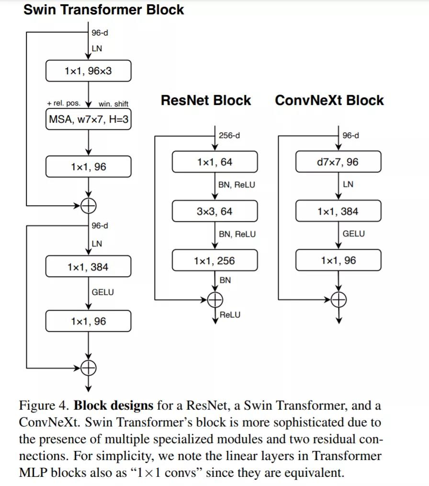
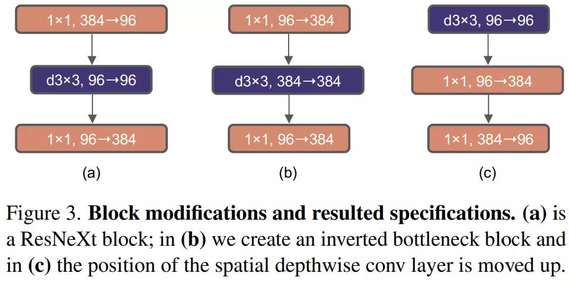
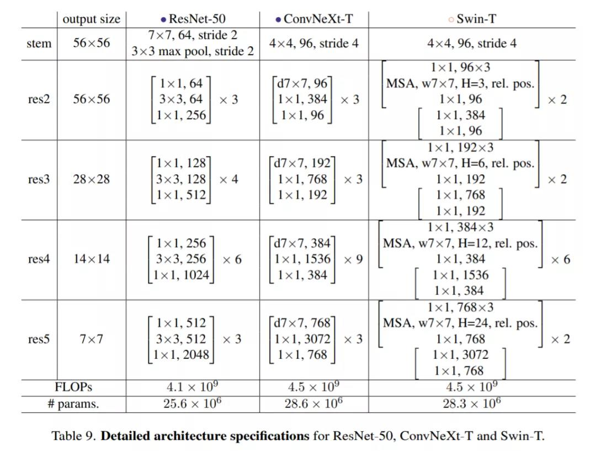
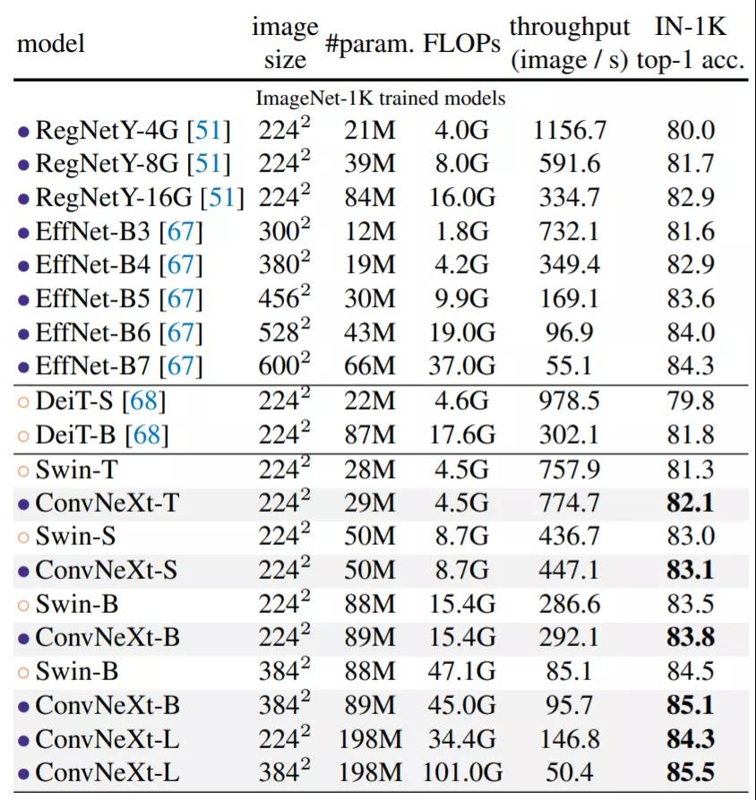
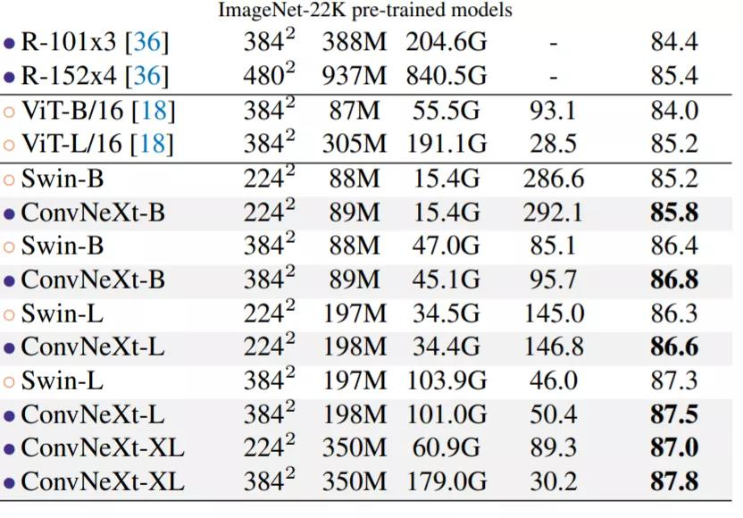
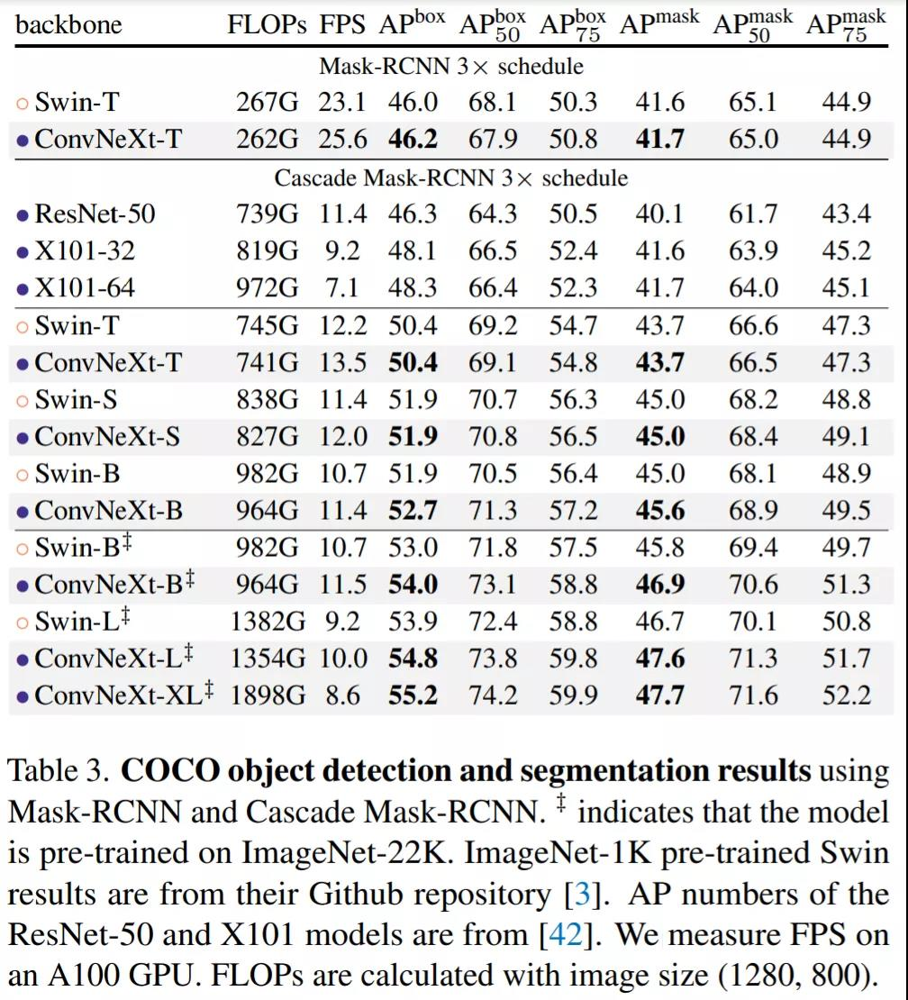

# 
A ConvNet for the 2020s

## 
1/18 By Jiakun, Wang

## 1.相关背景
&emsp;&emsp;《2020年代的卷积神经网络》[论文链接](https://arxiv.org/abs/2201.03545)
&emsp;&emsp;卷积神经网络在最近的十年开创了计算机视觉的新时代，大约在同一时间，自然语言处理领域transformer的出现取代了循环神经网络，成为主流的骨干结构。2020年，ViT的引入完全改变了网络架构设计的格局，在图像分类任务上，Transformers可以在很大程度上超过标准ResNets的表现。但计算机视觉并不限于图像分类任务，ViT的全局注意力设计复杂度与输入大小呈二次方，对于高分辨率的输入来说，就变得难以解决了。
&emsp;&emsp;Swin Transformer提出的滑动窗口策略证明了Transformer可以作为一个通用的视觉骨干，并在图像分类之外的一系列计算机视觉任务中获得最先进的性能。也揭露了一件事，卷积并没有变得无关紧要，相反，它仍然备受期待。

## 2.写作目的
&emsp;&emsp;很多用于计算机视觉的 Transformer的进步都是以带回卷积为目的，但性能差异通常是由于Transformer卓越的扩展性，多头注意力机制是非常关键的一部分。Convnet和分层Transformer都具备了类似的归纳偏好，但在训练过程和宏观/微观层面上的架构设计上有很大的不同。
&emsp;&emsp;在本文中，作者将研究ConvNet和Transformer之间的架构区别，测试纯ConVnet能达到的极限。

## 3.解决方案
&emsp;&emsp;作者从一个标准的ResNet开始，用改进的程序进行训练，逐步修改该架构，以构建一个层次化的视觉Transformer。作者提出了一个叫做ConvNetx的纯ConvNets系列并在各种任务上进行评估，ConvNets在准确性和可扩展性方面取得了与Transformer具有竞争力的结果，同时保持标准ConvNet的简单性和有效性。

## 4.核心思想及创新点
&emsp;&emsp;该研究梳理了从ResNet到类似于Transformer的卷积神经网络的发展轨迹，为了研究Swin Transformer的设计和标准卷积神经网络的简单性，从ResNet20出发，首先使用用于训练视觉Transformer的训练方法对其进行训练，与原始ResNet50相比性能获得了很大的提升，并将改进后的结果作为基线。
&emsp;&emsp;该研究制定了一系列设计决策，总结为1宏观设计 2ResNeXt 3反转瓶颈 4卷积核大小 5各种逐层微设计，所有模型均在Imag1k上进行训练和评估，并粗略控制了FLOPs。

### 4.1训练方法
&emsp;&emsp;除了网络结构的设计，训练过程也会影响到最终的性能。视觉Transformer引入了不同的训练技术(AdamW优化器)，这主要涉及到优化策略和相关的超参数设置。因此，该研究的第一步是使用和视觉Transforer相同的训练过程训练基线模型，从ResNet原始的90个epoch扩展到了300个epoch。
&emsp;&emsp;该研究使用了AdamW优化器，Mixup,cutmix等数据增强技术，以及随机深度和标签平滑等正则化方案，这种改进的训练方案将ResNet模型的性能从76.1%提高到78.8%，这意味着传统ConvNet和视觉Transformer之间的性能差异很大一部分是由于训练技术造成的。

### 4.2宏观设计
&emsp;&emsp;该研究分析了Swin Transformer的宏观网络设计。Swin使用类似卷积的多阶段设计，每个阶段具有不同的特征图分辨率。其中两个重要的考量是阶段计算比和主干架构。

#### 4.2.1阶段计算比
&emsp;&emsp;该研究将每个阶段的块数从ResNet50的（3，4，6，3）调整为（3，3，9，s3），使得FLOPs与swin对齐，将模型准确率从78.8%提高到了79.4%.

#### 4.2.2主干架构
&emsp;&emsp;通常，主干架构重点关注网络如何处理输入图像。由于自然图像中固有的冗余性，普通架构在标准 ConvNet 和视觉 Transformer 中积极地将输入图像下采样到适当的特征图大小。标准 ResNet 中包含一个步长为 2 的 7×7 卷积层和一个最大池，这让输入图像可进行 4 倍下采样。而视觉 Transformer 使用了「patchify」策略，Swin Transformer 虽然使用类似的「patchify」层，但使用更小的 patch 大小来适应架构的多阶段设计。该研究将 ResNet 主干架构替换为使用 4×4、步长为 4 的卷积层实现的 patchify 层，准确率从 79.4% 提升为 79.5%。这表明 ResNet 的主干架构可以用更简单的 patchify 层替代。

### 4.3ResNeXt-ify
&emsp;&emsp;第三步该研究尝试采用 ResNeXt 的思路，ResNeXt 比普通的 ResNet 具有更好的 FLOPs / 准确率权衡。核心组件是分组卷积，其中卷积滤波器被分成不同的组。ResNeXt 的指导原则是「使用更多的组，扩大宽度」。更准确地说，ResNeXt 对瓶颈块中的 3×3 卷积层采用分组卷积。由于显著降低了 FLOPs，因此这扩展了网络宽度以补偿容量损失。

&emsp;&emsp;该研究使用分组卷积的一种特殊情况——深度卷积（depthwise convolution），其中组数等于通道数。深度卷积已被 MobileNet 和 Xception 使用。研究者注意到，深度卷积类似于自注意力中的加权求和操作，在每个通道的基础上进行操作，即仅在空间维度上混合信息。深度卷积的使用有效地降低了网络的 FLOPs。按照 ResNeXt 中提出的策略，该研究将网络宽度增加到与 Swin-T 的通道数相同（从 64 增加到 96）。随着 FLOPs (5.3G) 的增加，网络性能达到了 80.5%。

### 4.4反转瓶颈
&emsp;&emsp;Transformer 中一个重要的设计是创建了反转瓶颈，即 MLP 块的隐藏维度比输入维度宽四倍，如下图  所示。有趣的是，Transformer 的这种设计与卷积神经网络中使用的扩展比为 4 的反转瓶颈设计有关联。

&emsp;&emsp;因此该研究第四步探索了反转瓶颈的设计。如下图 3所示，尽管深度卷积层的 FLOPs 增加了，但由于下采样残差块的 shortcut 1×1 卷积层的 FLOPs 显著减少，整个网络的 FLOPs 减少到 4.6G。有趣的是，这会让性能从 80.5% 稍稍提高至 80.6%。在 ResNet-200 / Swin-B 方案中，这一步带来了更多的性能提升——从 81.9% 提升到 82.6%，同时也减少了 FLOPs。

### 4.5卷积核大小
&emsp;&emsp;第五步该研究探索了大型卷积核的作用。视觉 Transformer 最显著的特性是其非局部自注意力，每一层都具有全局感受野。虽然已有卷积神经网络使用了大卷积核，但黄金标准（VGGNet [62] ）是堆叠小卷积核（3×3）的卷积层。尽管 Swin Transformer 重新将局部窗口引入到自注意力块中，但窗口大小至少为 7×7，明显大于 3×3 的 ResNe(X)t 卷积核大小。因此该研究重新审视了在卷积神经网络中使用大卷积核的作用。
#### 4.5.1向上移动深度卷积层
&emsp;&emsp;要探索大卷积核，一个先决条件是向上移动深度卷积层的位置（如上图 (c) 所示）。类似地，Transformer 中也将 MSA 块放置在 MLP 层之前。由于已经设置一个反转瓶颈块，复杂、低效的模块（MSA、大卷积核）通道变少，而高效、密集的 1×1 层将完成繁重的工作。因此这个中间步骤将 FLOPs 减少到 4.1G，导致性能暂时下降到 79.9%。
#### 4.5.2增大卷积核
&emsp;&emsp;经过上述准备工作，采用更大的卷积核是具有显著优势的。该研究尝试了几种卷积核大小：3、5、7、9、11。网络的性能从 79.9% (3×3) 提高为 80.6% (7×7)，而网络的 FLOPs 大致保持不变。
&emsp;&emsp;此外，研究者观察到较大的卷积核的好处是在 7×7 处会达到饱和点，并在大容量模型中验证了这种行为。当卷积核大小超过 7×7 时，ResNet-200 机制模型没有表现出进一步的增益。因此该研究在每个块中都使用了 7×7 深度卷积。

### 4.6微观设计
&emsp;&emsp;下一步研究者探究了一些微观尺度上的架构差异——这里的大部分探索都是在层级完成的，重点是激活函数和归一化层的具体选择。
#### 4.6.1用GELU替代ReLU
&emsp;&emsp;用 GELU 替代 ReLU。随着时间的推移，研究者已经开发了许多激活函数，但 ReLU 由于其简单性和有效性，仍然在 ConvNet 中广泛使用。ReLU 也被用作原始 Transformer 中的激活函数。GELU 可以被认为是 ReLU 的更平滑变体，被用于最先进的 Transformer，包括 Google 的 BERT 和 OpenAI 的 GPT-2 ，以及 ViT 等。该研究发现 ReLU 在 ConvNet 中也可以用 GELU 代替，准确率保持不变（80.6%）。
#### 4.6.2更少的激活函数
&emsp;&emsp;Transformer 和 ResNet 块之间的一个小区别是 Transformer 的激活函数较少。如上图 所示，该研究从残差块中消除了所有 GELU 层，除了在两个 1×1 层之间的 GELU 层，这是复制了 Transformer 块的风格。这个过程将结果提高了 0.7% 到 81.3%，实际上与 Swin-T 性能相当。 
#### 4.6.3更少的归一化层
&emsp;&emsp;Transformer 块通常也具有较少的归一化层。在这里，该研究删除了两个 BatchNorm (BN) 层，在 conv 1 × 1 层之前只留下一个 BN 层。这进一步将性能提升至 81.4%，已经超过了 Swin-T 的结果。请注意，该研究的每个块的归一化层比 Transformer 还要少，研究人员发现在块的开头添加一个额外的 BN 层并不能提高性能。
#### 4.6.4用LN代替BN
&emsp;&emsp;BatchNorm（BN）是 ConvNet 中的重要组成部分，因为它提高了收敛性并减少了过拟合。然而，BN 也有许多错综复杂的东西，可能会对模型的性能产生不利影响 。研究者曾多次尝试开发替代方案，但 BN 仍然是大多数视觉任务的首选方法。在原始 ResNet 中直接用 LN 代替 BN 性能欠佳。随着网络架构和训练技术的改进，该研究重新审视使用 LN 代替 BN 的影响，得出 ConvNet 模型在使用 LN 训练时没有任何困难；实际上，性能会改进一些，获得了 81.5% 的准确率。
#### 4.6.5分离式下采样层
&emsp;&emsp;在 ResNet 中，空间下采样是通过每个 stage 开始时的残差块来实现的，使用 stride =2 的 3×3 卷积。在 Swin Transformer 中，在各个 stage 之间添加了一个分离式下采样层。该研究探索了一种类似的策略，在该策略中，研究者使用 stride =2 的 2×2 卷积层进行空间下采样。令人惊讶的是，这种改变会导致不同的训练结果。进一步调查表明，在空间分辨率发生变化的地方添加归一化层有助于稳定训练。该研究可以将准确率提高到 82.0%，大大超过 Swin-T 的 81.3%。该研究采用分离式下采样层，得到了最终模型 ConvNeXt。ResNet、Swin 和 ConvNeXt 块结构的比较如图 4 所示。

ResNet-50、Swin-T 和 ConvNeXt-T 的详细架构规范的比较如表 9 所示。

## 5.实验结果
### 5.1ImageNet实验评估
Results ImageNet-1K：下表是 ConvNeXt 与 Transformer 变体 DeiT、Swin Transformer，以及 RegNets 和 EfficientNets 的结果比较。

由结果可得：ConvNeXt 在准确率 - 计算权衡以及推理吞吐量方面取得了与 ConvNet 基线（RegNet 和 EfficientNet ）具有竞争力的结果；ConvNeXt 的性能也全面优于具有类似复杂性的 Swin Transformer；与 Swin Transformers 相比，ConvNeXts 在没有诸如移位窗口或相对位置偏置等专门模块的情况下也具有更高的吞吐量。

ImageNet-22K：下表（表头参考上表）中展示了从 ImageNet-22K 预训练中微调的模型的结果。这些实验很重要，因为人们普遍认为视觉 Transformer 具有较少的归纳偏置，因此在大规模预训练时可以比 ConvNet 表现更好。该研究表明，在使用大型数据集进行预训练时，正确设计的 ConvNet 并不逊于视觉 Transformer——ConvNeXt 的性能仍然与类似大小的 Swin Transformer 相当或更好，吞吐量略高。此外，该研究提出的 ConvNeXt-XL 模型实现了 87.8% 的准确率——在 384^2 处比 ConvNeXt-L 有了相当大的改进，证明了 ConvNeXt 是可扩展的架构。

### 5.2下游任务评估
在 COCO 上的目标检测和分割研究：该研究以 ConvNeXt 为主干，在 COCO 数据集上微调 Mask R-CNN 和 Cascade Mask R-CNN 。表 3 比较了 Swin Transformer、ConvNeXt 和传统 ConvNet（如 ResNeXt）在目标检测和实例分割上的结果。结果表明在不同的模型复杂性中，ConvNeXt 的性能与 Swin Transformer 相当或更好。

## 6.启发
&emsp;&emsp;Fair的这篇文章感觉更多的是堆trick，做了非常多的实验也足够严谨。可能对于工业界是一个好消息，transformer在部署端更难。个人感觉像Swin这类的分层Transformer越来越接近cnn的设计，如分层下采样和滑动窗口等但又不如cnn优美自然，反观ViT这种原汁原味的attention机制，没有使用任何的先验信息，这是否有一种绕回去的感觉。还有的疑惑就是，如果参数量足够大的话，模型结构是否已经不重要了，因为已经足够拟合，从ConvNeXt和swin表现出的性能相当来看。个人觉得transformer在dl上有更好的物理解释性，在新的算子提出来之前，应该是attention和cnn的继续结合吧。
