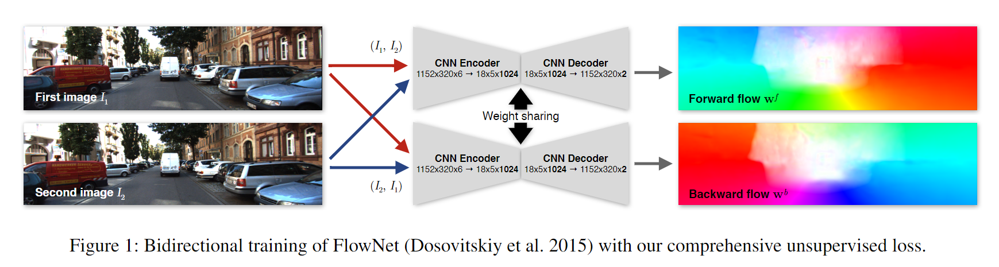
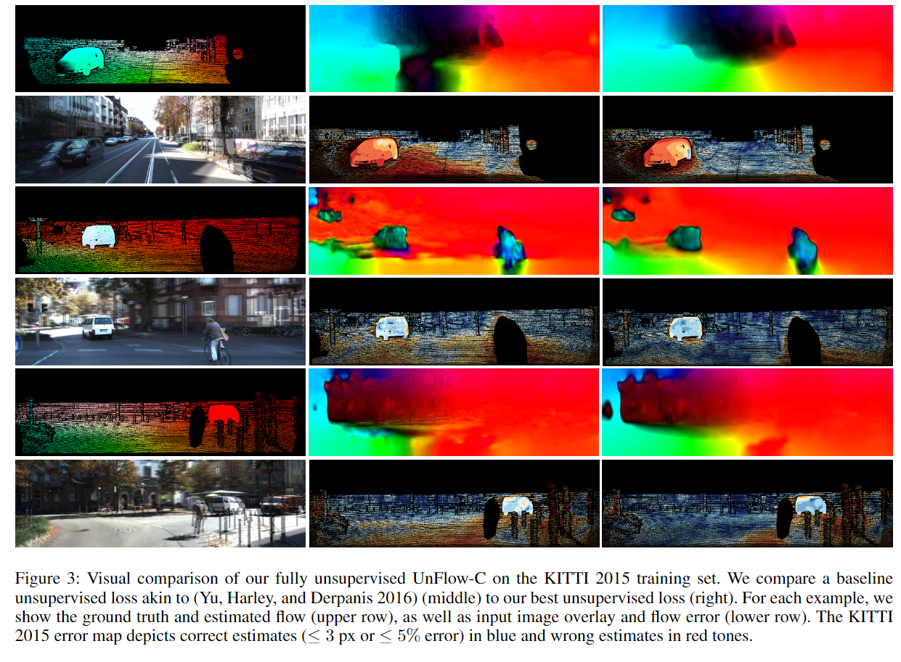
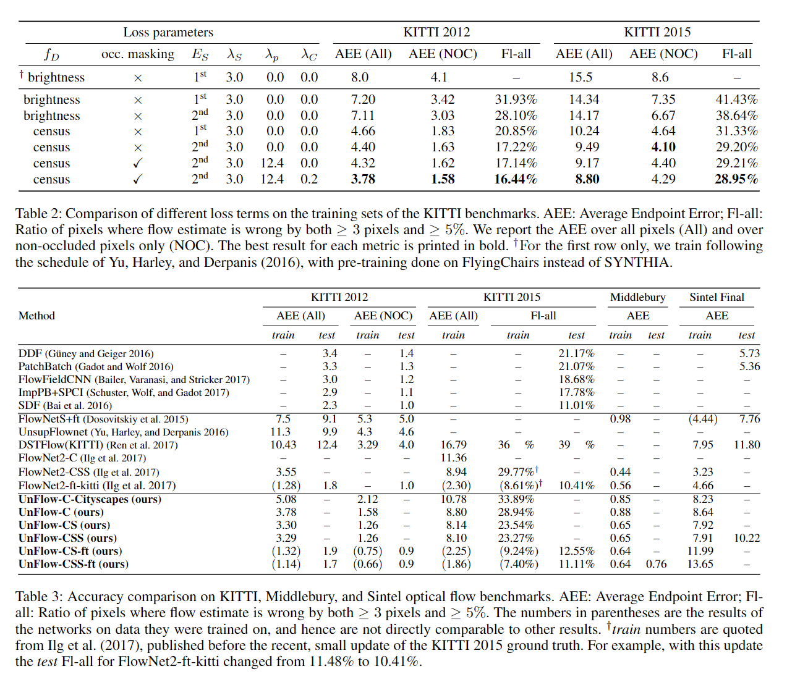

# 
UnFlow: Unsupervised Learning of Optical Flow with a Bidirectional Census Loss
 

By Mars Zhang

## 论文获取
&emsp;&emsp;《UnFlow: 具有双向统计损失的无监督光流算法》，appear in AAAI 2018，Subjects:	Computer Vision and Pattern Recognition(cs. CV),引用格式为：

Meister, S. ,  Hur, J. , &  Roth, S. . (2017). Unflow: unsupervised learning of optical flow with a bidirectional census loss.

[代码下载链接](https://github.com/tornadomeet/UnFlow)
[论文下载链接](https://arxiv.org/pdf/1711.07837)
[演讲幻灯片链接](https://drive.google.com/open?id=1hpguALCru1M5sUInzeBCzKlVeSY0EM9N)

# 论文背景
&emsp;&emsp;最近用于光流的端到端卷积网络依赖于合成数据集进行监督，但训练和测试场景之间的域不匹配是一个挑战。受经典的基于能量的光流方法的启发，本文设计了一种基于遮挡感知双向流估计和robust census transform的无监督损失，以克服对实际流的需求。在 KITTI 基准测试中，我们的无监督方法大大优于以前的无监督深度网络，甚至比仅在合成数据集上训练的类似监督方法更准确。通过选择性地对 KITTI 训练数据进行微调，我们的方法在 KITTI 2012 和 2015 基准上实现了具有竞争力的光流精度，因此此外还可以对具有有限真实数据的数据集的监督网络进行通用预训练。

## 知识梳理
&emsp;&emsp;大多数基于 CNN 的方法都依赖于大量数据的可用性以及实际光流来进行监督学习。由于在真实场景中难以获得ground truth，此类网络在合成生成的图像上进行训练。由于合成图像和真实图像之间的内在差异以及合成数据集的有限可变性，对真实场景的泛化仍然具有挑战性。本文认为，为了实现深度学习在光流中的潜力，解决这个问题将是至关重要的。  
&emsp;&emsp;本文将合成数据的监督替换为类似于（Yu、Harley 和 Derpanis 2016）的无监督光度重建损失。我们通过交换两个输入图像执行第二次传递来计算双向光流（即，向前和向后方向，见下图）。然后，设计了一个损失函数，利用双向流来明确地推理遮挡（Hur and Roth 2017）。

 

主要思路：向前遍历光流向量再向后遍历应该回到同一个位置，根据亮度不变假设设计loss。  
网络结构：输入为2帧，分别计算前向光流和方向光流。  
存在遮挡问题：即在下一帧里观测不到对应pixel（比如人往前走，被其他物体挡住了）  
判断有无遮挡的基本解决思路：前向后再反向，回不到原位置，则判断为被遮挡。具体如下式：$$|w^f(x) + w^b(x+w^f(x))|^2 < \alpha_1(|w^f(x)|^2+|w^b(x+w^f(x))|^2)+\alpha_2$$
&emsp;&emsp;其中$x$表示坐标，$w^f(x)$表示根据前向光流进行warp操作。对应的$w^b(x)$为根据反向光流进行操作。$\alpha_1,\alpha_2$为调节参数（调节误差允许范围）,文中$\alpha_1=0.01,\alpha_2=0.5$。即在无遮挡情况下，左边那项和应该趋近于0。若不满足条件则认为存在遮挡，这部分则不计算loss。（因为loss根据亮度不变假设，若pixel被遮挡了，通过计算亮度恒定来设计loss就不合理了）。  
总loss：$$E(W^f,W^b,o^f,o^b)=E_D(W^f,W^b,o^f,o^b)+\lambda_SE_S(W^f,W^b)+\lambda_CE_C(W^f,W^b,o^f,o^b)$$
亮度一致性loss($E_D$)：$$E_D(W^f,W^b,o^f,o^b)=\sum_{x\in P}(1-o_x^f)\cdot\rho(f_D(I_1(x),I_2(x+w^f(x))))+(1-o_x^b)\cdot\rho(f_D(I_1(x),I_2(x+w^b(x))))+o_x^f\lambda_p+o_x^b\lambda_p$$
$f_D(I_1,I_2)$为measures the photometric difference,如$f_D(I_1,I_2)=I_1(x)-I_2(x)$，$\rho(x)=|x^2 +\epsilon|^\gamma$即只计算无遮挡的部分。
Smoothness loss($E_S$)：$$E_S(W^f,W^b)=\sum_{x\in P(s,r)\in N(x)}\sum\rho(w^f(s)-2W^f(x)+W^f(r))+\rho(W^b(s)-2W^b(x)+W^b(r))$$
光流平滑loss，即防止相邻像素的光流值相差太大s,r为x的相邻坐标，包括4个方向（左右，上下，加2个对角方向）  
forward-backward一致性损失($E_C$)：$$E_C(W^f,W^b,o^f,o^b)=\sum_{x\in P}(1-o_x^f)\cdot\rho(W^f(x)+W^b(x+W^f(s)))+(1-o_x^b)\cdot\rho(W^b(x)+W^f(x+W^b(s)))$$
和亮度一致性损失类似，只是直接作用于光流。而亮度一致性损失是计算灰度值的差值。

## 实验与结论

 

 

&emsp;&emsp;本文提出了一种端到端的无监督学习方法，可以在没有光流地面实况的大型数据集上有效地训练 FlowNet 网络。为此，我们利用了经过充分验证的基于能量的流方法的组件，例如基于census transform的数据丢失、高阶平滑度以及通过双向流估计启用的遮挡推理。实验表明，使用准确的无监督损失是利用未注释数据集进行光流的关键，与以前的无监督深度学习方法相比，具有挑战性的 KITTI 基准测试的误差减少了一半以上。因此，使用于光流的 CNN 适用于更大范围的领域。此外，当只有手工合成的数据集可用于监督时，使用大型真实数据集和我们的无监督损失甚至可以在具有挑战性的现实基准上优于监督训练。

## 个人观点
&emsp;&emsp;初始感觉估计遮挡部分会很难收敛，但实际效果还可以。后续的无监督论文也挺多遵照这个思路去估算遮挡部分。